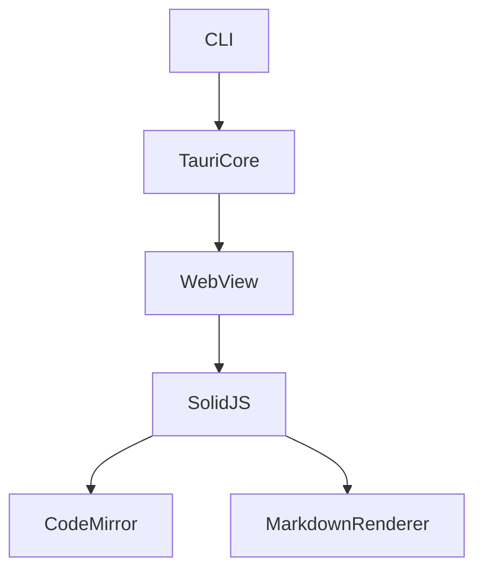

# Technical Design Rules and Principles

## Core Design Principles

### 1. Type Safety is Mandatory
- **TypeScript**: NEVER use `any` type. Prefer precise types and generics
- **Rust**: Leverage the type system fully. Avoid unnecessary `unsafe` blocks
- **IPC Boundary**: Tauri command types must match between TypeScript and Rust
- Use discriminated unions for error handling in TypeScript
- Use `Result<T, E>` for error handling in Rust

### 2. Design vs Implementation
- **Focus on WHAT, not HOW**
- Define interfaces and contracts, not code
- Specify behavior through pre/post conditions
- Document architectural decisions, not algorithms

### 3. Visual Communication
- **Simple features**: Basic component diagram or none
- **Medium complexity**: Architecture + data flow
- **High complexity**: Multiple diagrams (architecture, sequence, state)
- **Always pure Mermaid**: No styling, just structure

### 4. Component Design Rules
- **Single Responsibility**: One clear purpose per component
- **Clear Boundaries**: Explicit domain ownership (Frontend vs Rust backend)
- **Dependency Direction**: Follow architectural layers (UI → Logic → IPC → Rust)
- **Interface Segregation**: Minimal, focused interfaces
- **Team-safe Interfaces**: Design boundaries that allow parallel implementation
- **Research Traceability**: Record boundary decisions in `research.md`

### 5. Frontend/Backend Separation
- **Rust is Minimal**: File I/O, CLI args, OS integration only
- **Frontend is Primary**: UI, logic, state management in SolidJS
- **IPC is the Bridge**: Well-defined Tauri commands connect the two
- **Type Contract**: TypeScript types and Rust structs must agree

### 6. Error Handling Philosophy
- **Fail Fast**: Validate early and clearly
- **Graceful Degradation**: Partial functionality over complete failure
- **User Context**: Actionable error messages in the UI
- **Observability**: Structured logging in both Rust and TypeScript

### 7. Integration Patterns
- **Loose Coupling**: Minimize dependencies between components
- **Contract First**: Define Tauri IPC interfaces before implementation
- **Versioning**: Plan for API evolution
- **Idempotency**: Design for retry safety

## Documentation Standards

### Language and Tone
- **Declarative**: "The system renders markdown" not "The system should render"
- **Precise**: Specific technical terms over vague descriptions
- **Concise**: Essential information only
- **Formal**: Professional technical writing

### Structure Requirements
- **Hierarchical**: Clear section organization
- **Traceable**: Requirements to components mapping
- **Complete**: All aspects covered for implementation
- **Consistent**: Uniform terminology throughout
- **Focused**: Keep design.md centered on architecture and contracts

## Section Authoring Guidance

### Global Ordering
- Default flow: Overview → Goals/Non-Goals → Requirements Traceability → Architecture → Technology Stack → System Flows → Components & Interfaces → Data Models → Optional sections.

### Requirement IDs
- Reference requirements as `2.1, 2.3` without prefixes.
- All requirements MUST have numeric IDs.

### Technology Stack
- Include ONLY layers impacted by this feature.
- For each layer specify tool/library + version + role.

### System Flows
- Add diagrams only when they clarify behavior.
- Always use pure Mermaid.

### Requirements Traceability
- Use the standard table to prove coverage.

### Components & Interfaces Authoring
- Group components by domain/layer.
- Begin with a summary table.
- Dependencies table must mark each entry as Inbound/Outbound/External with Criticality.

### Diagram Guidelines

- **Plain Mermaid only** – avoid custom styling.
- **Node IDs** – alphanumeric plus underscores only.
- **Labels** – simple words. No parentheses, brackets, quotes, or slashes.
- **Edges** – show data or control flow direction.

## Quality Metrics
### Design Completeness Checklist
- All requirements addressed
- No implementation details leaked
- Clear component boundaries (Frontend / Rust / IPC)
- Explicit error handling
- Comprehensive test strategy
- Security considered (file access, XSS)
- Performance targets defined (startup time, large file handling)

### Common Anti-patterns to Avoid
❌ Mixing design with implementation
❌ Vague interface definitions
❌ Missing error scenarios
❌ Putting too much logic in Rust (should be minimal)
❌ Overcomplicated architectures
❌ Tight coupling between frontend and backend
❌ Missing IPC type contracts
