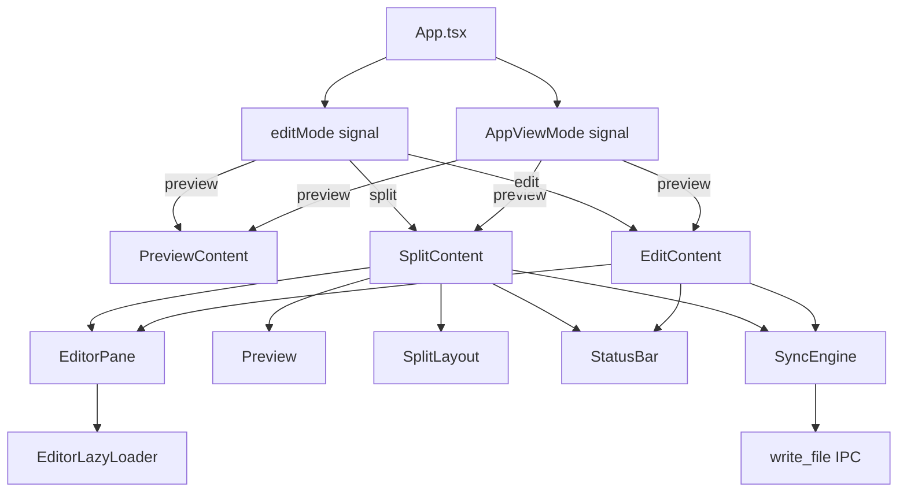
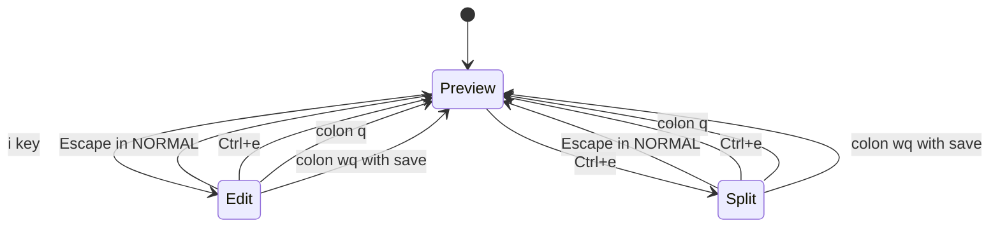
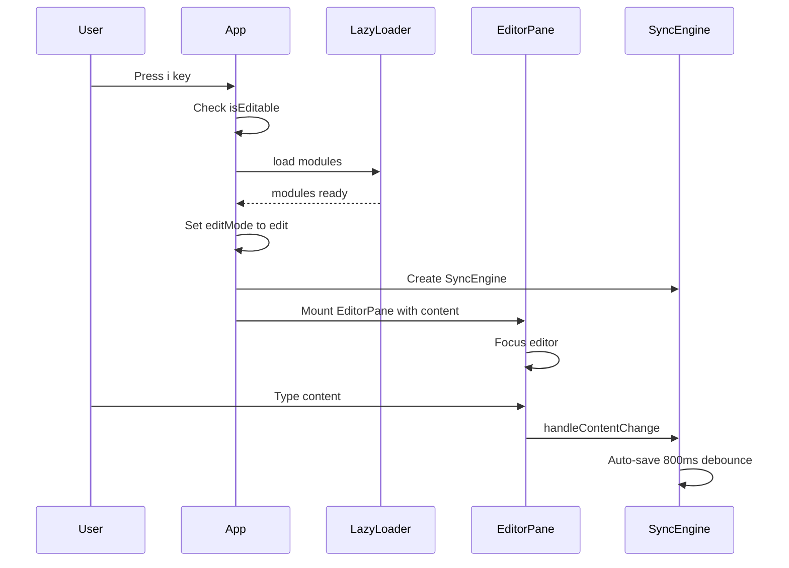
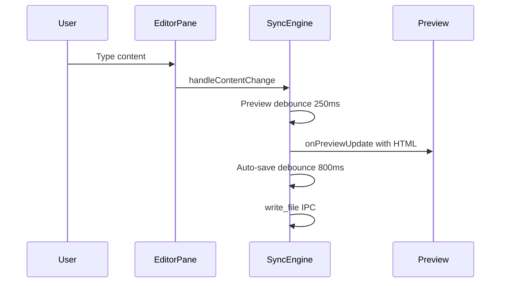

# Design Document: edit-split-mode

## Overview

**Purpose**: ファイルプレビュー中に Preview / Edit / Split の3モードをシームレスに切り替えられるようにし、読む→書くの一貫したワークフローを実現する。

**Users**: ターミナルAI開発者が、Markdownファイルの閲覧中に即座に編集に入り、リアルタイムプレビューを見ながら作業できる。

**Impact**: 現在の読み取り専用プレビューに、既存の EditorPane / SplitLayout / StatusBar / SyncEngine を再接続し、モード切替 UI を追加する。

### Goals
- Preview → Edit → Split のモード切替を Vim キーバインドで実現
- 既存コンポーネントの再利用（新規コンポーネント作成なし）
- モード切替時の状態（内容・スクロール位置・dirty状態）保持
- Buffer モード（stdin/clipboard/URL）では編集不可を維持

### Non-Goals
- インラインプレビュー編集（contentEditable による WYSIWYG）
- 新規 Rust コマンドの追加（write_file は既存）
- Split モードでのスクロール同期（エディタ↔プレビュー）
- カスタムキーバインド設定 UI

## Architecture

### Existing Architecture Analysis

現在の構造:
- `App.tsx` が `AppViewMode` signal で トップレベル状態（loading/demo/file-list/preview/buffer/error）を管理
- `preview` 状態で `PreviewContent` コンポーネントを表示（TOC + Preview + HeadingPicker）
- `useVimNav` がドキュメントレベルの keydown でプレビュー内ナビゲーションを処理
- `bufferManager.state.isEditable` がファイルソースの編集可否を判定

### Architecture Pattern & Boundary Map



**Architecture Integration**:
- Selected pattern: サブモード Signal パターン — `editMode` signal を `AppViewMode` と独立管理
- Frontend/Backend boundaries: Rust 側は既存の write_file コマンドのみ。変更なし
- IPC contract: 既存の `write_file` をそのまま使用
- Existing patterns preserved: SolidJS Signal, 遅延ロード, debounce sync

### Technology Stack

| Layer | Choice / Version | Role in Feature | Notes |
|-------|------------------|-----------------|-------|
| Frontend | SolidJS + TypeScript | モード切替 Signal, UI ルーティング | 変更あり |
| Editor | CodeMirror 6 + @replit/codemirror-vim | Vim 編集 | 既存、再接続のみ |
| Sync | sync.ts (SyncEngine) | プレビュー更新 + 自動保存 | 既存、再接続のみ |
| Backend | Rust (Tauri v2) | write_file IPC | 変更なし |

## System Flows

### モード切替フロー



### Edit モード起動フロー



### Split モードプレビュー更新フロー



## Requirements Traceability

| Requirement | Summary | Components | Interfaces | Flows |
|-------------|---------|------------|------------|-------|
| 1.1 | i キーで Edit | App, useVimNav | editMode signal | モード切替 |
| 1.2 | Escape で Preview 復帰 | App, EditorPane | editMode signal, vimMode | モード切替 |
| 1.3 | Ctrl+e で Split | App | editMode signal | モード切替 |
| 1.4 | Ctrl+e で Preview 復帰 | App | editMode signal | モード切替 |
| 1.5 | Buffer モードで編集無効 | App, BufferManager | isEditable | - |
| 1.6 | file-list/error で無効 | App | AppViewMode | - |
| 2.1 | CodeMirror 遅延ロード | EditorLazyLoader | LazyLoaderResult | Edit 起動 |
| 2.2 | Vim キーバインド | EditorPane | CMEditorConfig | - |
| 2.3 | StatusBar 表示 | StatusBar | StatusBarProps | - |
| 2.4 | 自動保存 | SyncEngine | SyncEngineConfig | プレビュー更新 |
| 2.5 | :w 保存 | SyncEngine, EditorPane | CMEditorConfig | - |
| 2.6 | :wq 保存して戻る | SyncEngine, EditorPane, App | editMode signal | モード切替 |
| 2.7 | :q で戻る | EditorPane, App | editMode signal | モード切替 |
| 3.1 | SplitLayout 表示 | SplitLayout | SplitLayoutProps | Split 起動 |
| 3.2 | ディバイダードラッグ | SplitLayout | - | - |
| 3.3 | プレビューデバウンス | SyncEngine | SyncEngineConfig | プレビュー更新 |
| 3.4 | Split StatusBar | StatusBar | StatusBarProps | - |
| 3.5 | Split 自動保存 | SyncEngine | SyncEngineConfig | プレビュー更新 |
| 4.1 | 内容をエディタに反映 | App | markdown signal | - |
| 4.2 | エディタ内容でプレビュー更新 | App, SyncEngine | - | - |
| 4.3 | 切替前自動保存 | SyncEngine | forceSave | - |
| 4.4 | ロード失敗時フォールバック | App, EditorLazyLoader | LoaderState | - |
| 5.1 | タブ切替でエディタ更新 | App, EditorPane | CMEditorInstance | - |
| 5.2 | 外部変更通知 | FileWatcher, EditorPane | - | - |
| 5.3 | ファイルドロップ | App | editMode signal | - |
| 5.4 | ショートカット維持 | App | handleKeyDown | - |

## Components and Interfaces

| Component | Domain/Layer | Intent | Req Coverage | Key Dependencies | Contracts |
|-----------|--------------|--------|--------------|------------------|-----------|
| App (変更) | UI / Orchestration | モード切替ロジック、ルーティング | 1.1-1.6, 4.1-4.4, 5.1-5.4 | editMode signal, LazyLoader, SyncEngine | State |
| EditorPane (既存) | UI / Editor | CodeMirror ホスト | 2.1-2.7 | CodeMirrorModules, CMEditorConfig | - |
| SplitLayout (既存) | UI / Layout | リサイズ可能 2ペイン | 3.1-3.2 | left/right JSX.Element | - |
| StatusBar (既存) | UI / Status | Vim モード・カーソル・dirty 表示 | 2.3, 3.4 | StatusBarProps | - |
| SyncEngine (既存) | Logic / Sync | デバウンスプレビュー+自動保存 | 2.4-2.5, 3.3, 3.5, 4.3 | SyncEngineConfig, write_file IPC | - |
| EditorLazyLoader (既存) | Logic / Loading | CodeMirror 遅延ロード | 2.1, 4.4 | - | - |
| useVimNav (変更) | Logic / Navigation | プレビュー内 Vim ナビ | 1.1 | editMode signal | - |

### UI / Orchestration

#### App.tsx (変更)

| Field | Detail |
|-------|--------|
| Intent | モード切替ロジックの追加、Edit/Split コンテンツのルーティング |
| Requirements | 1.1-1.6, 4.1-4.4, 5.1-5.4 |

**Responsibilities & Constraints**
- `editMode` signal の管理（"preview" | "edit" | "split"）
- EditorLazyLoader の初期化とモジュールキャッシュ
- SyncEngine のライフサイクル管理（作成・破棄）
- Vim モード / カーソル位置 / dirty 状態の signal 管理
- モード切替時の状態移行（内容同期、自動保存）

**Dependencies**
- Inbound: TabStore — アクティブタブ内容 (Critical)
- Inbound: FileWatcher — 外部変更通知 (Important)
- Outbound: EditorPane — エディタ表示 (Critical)
- Outbound: SplitLayout — Split 表示 (Critical)
- Outbound: StatusBar — 状態表示 (Important)
- Outbound: SyncEngine — 同期・保存 (Critical)

**Contracts**: State

##### State Management

**新規 Signals**:
```typescript
// Edit mode sub-state (only relevant when AppViewMode is "preview")
type EditMode = "preview" | "edit" | "split";
const [editMode, setEditMode] = createSignal<EditMode>("preview");

// Editor state signals
const [vimMode, setVimMode] = createSignal<"NORMAL" | "INSERT" | "VISUAL" | "COMMAND">("NORMAL");
const [cursorPosition, setCursorPosition] = createSignal<{ line: number; col: number }>({ line: 1, col: 1 });
const [isDirty, setIsDirty] = createSignal(false);
const [saveNotification, setSaveNotification] = createSignal<{ text: string; type: "success" | "error" } | null>(null);
```

**EditorLazyLoader**: App レベルで1回だけ `createEditorLazyLoader()` を呼び出し、モジュールをキャッシュ。

**SyncEngine ライフサイクル**:
- Edit/Split に切り替える時に `createSyncEngine()` で生成
- Preview に戻る時に `destroy()` で破棄
- タブ切替時に再作成

**CMEditorInstance ref**:
- `let editorRef: CMEditorInstance | null` で保持
- タブ切替時に `setContent()` で内容更新
- Preview 復帰時に `getContent()` で最新内容取得

##### キーバインド統合

`handleKeyDown` に追加するキーハンドラ:

```typescript
// i key: Preview → Edit (only when in preview editMode, file is editable, not in input)
// Ctrl+e: Toggle between Preview ↔ Split (or Edit → Preview)
```

`useVimNav` は `editMode() !== "preview"` の時はナビゲーションをスキップ。

##### EditContent コンポーネント（App.tsx 内部）

```typescript
// Inline component within App.tsx
const EditContent = () => (
  <>
    <div class="flex-1 min-h-0">
      <EditorPane
        modules={lazyLoader.getModules()}
        initialContent={markdown()}
        onContentChange={handleEditorChange}
        onVimModeChange={setVimMode}
        onCursorChange={setCursorPosition}
        onSaveCommand={handleSave}
        onSaveQuitCommand={handleSaveQuit}
        onQuitCommand={handleQuit}
        onEditorReady={handleEditorReady}
      />
    </div>
    <StatusBar
      vimMode={vimMode}
      cursorPosition={cursorPosition}
      isDirty={isDirty}
      notification={saveNotification}
    />
  </>
);
```

##### SplitContent コンポーネント（App.tsx 内部）

```typescript
const SplitContent = () => (
  <>
    <div class="flex-1 min-h-0">
      <SplitLayout
        left={
          <EditorPane
            modules={lazyLoader.getModules()}
            initialContent={markdown()}
            onContentChange={handleEditorChange}
            onVimModeChange={setVimMode}
            onCursorChange={setCursorPosition}
            onSaveCommand={handleSave}
            onSaveQuitCommand={handleSaveQuit}
            onQuitCommand={handleQuit}
            onEditorReady={handleEditorReady}
          />
        }
        right={<Preview html={html()} />}
      />
    </div>
    <StatusBar
      vimMode={vimMode}
      cursorPosition={cursorPosition}
      isDirty={isDirty}
      notification={saveNotification}
    />
  </>
);
```

### Logic / Navigation

#### useVimNav (変更)

| Field | Detail |
|-------|--------|
| Intent | Edit/Split モード時のナビゲーション無効化 |
| Requirements | 1.1 |

**変更内容**:
- `getEditMode` accessor を引数に追加
- `handleKeyDown` の冒頭で `editMode() !== "preview"` ならリターン
- `i` キーハンドラの追加（`onEnterEdit` コールバック経由）

```typescript
export interface VimNavOptions {
  onNextTab?: () => void;
  onPrevTab?: () => void;
  onEnterEdit?: () => void;  // NEW: i key callback
  getEditMode?: () => string; // NEW: editMode accessor
}
```

## Error Handling

### Error Strategy
- CodeMirror ロード失敗: `LoaderState === "error"` をキャッチし、エラー通知を表示して Preview を維持
- write_file 失敗: SyncEngine の `onSaveError` で StatusBar に赤色通知を表示。dirty 状態を維持
- EditorPane マウント失敗: try-catch で Preview にフォールバック

### Error Categories
- **User Errors**: 該当なし（キーバインドでのモード切替のため入力エラーは発生しない）
- **System Errors**: CodeMirror ロード失敗 → Preview 維持 + エラー通知
- **IPC Errors**: write_file 失敗 → StatusBar 通知 + dirty 維持 + リトライ不要（次回変更時に再試行）

## Testing Strategy

### Unit Tests
- editMode signal の状態遷移テスト（Preview ↔ Edit ↔ Split）
- モード切替条件テスト（buffer モードでは不可、file-list では不可）
- SyncEngine の既存テスト（変更なしのため既存カバレッジで十分）

### Integration Tests
- モード切替 → EditorPane マウント → 内容反映の一連フロー
- タブ切替 + Edit モード → エディタ内容更新
- :wq コマンド → 保存 + Preview 復帰

### E2E Tests
- ファイルを開く → `i` で Edit → 編集 → `Escape` で Preview → 内容反映確認
- ファイルを開く → `Ctrl+e` で Split → 編集 → プレビュー更新確認
- Edit モード → タブ切替 → 新タブの内容がエディタに反映

## Performance & Scalability
- CodeMirror モジュールは初回ロード後キャッシュされ、2回目以降のモード切替は即座（<10ms）
- SyncEngine の preview debounce (250ms) と auto-save debounce (800ms) で不要な IPC 呼び出しを抑制
- Edit→Preview 切替時の Markdown 再パースは既存の `processMarkdown` を使用（現状のパフォーマンス特性を維持）
