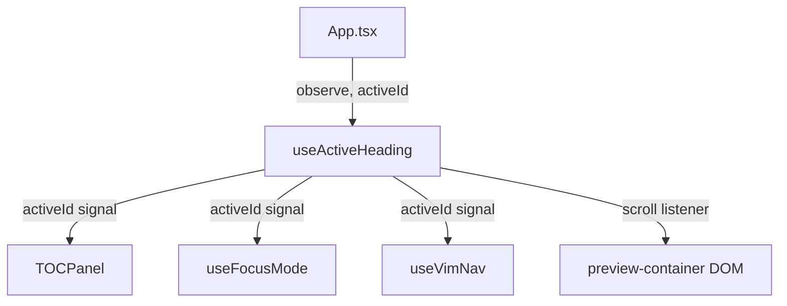
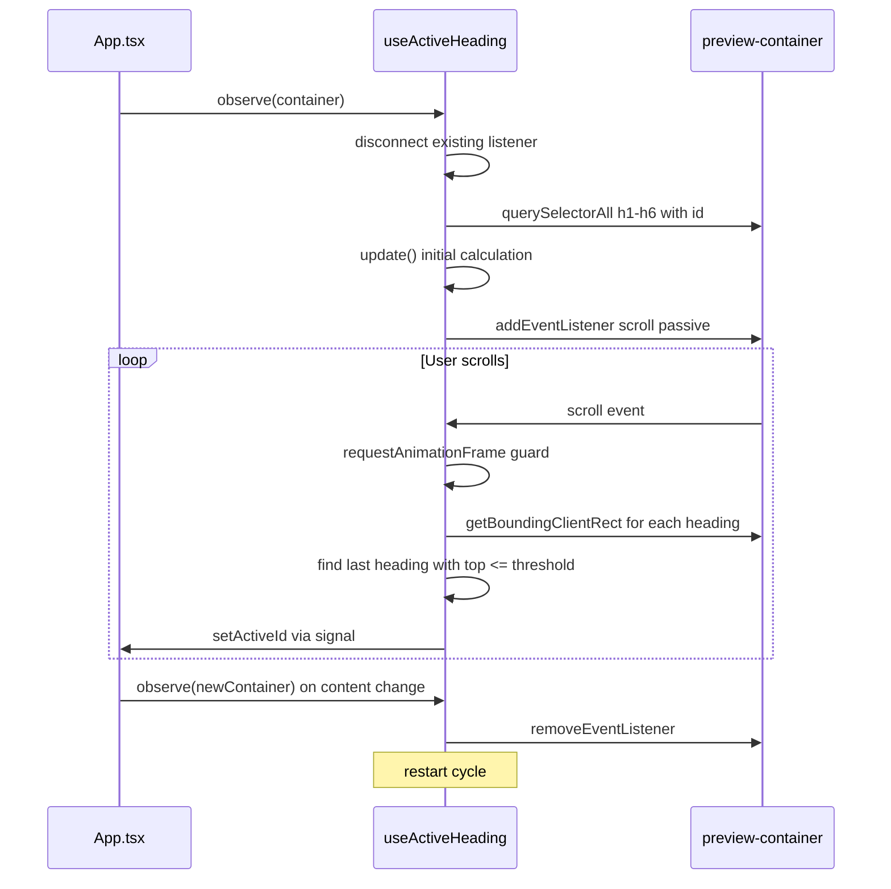

# Design Document

## Overview
**Purpose**: TOCパネルのアクティブ見出しハイライトがスクロール位置に関係なく最後の見出しに固定されるバグを修正する。`useActiveHeading` hook の内部実装を IntersectionObserver から scroll イベント + `getBoundingClientRect` ベースに置き換える。

**Users**: プレビューモードで Markdown を閲覧するすべてのユーザー。

**Impact**: `src/lib/useActiveHeading.ts` の内部実装のみ変更。公開インターフェース `{ activeId, observe, disconnect }` は維持し、消費側（App.tsx, TOCPanel, useFocusMode, useVimNav）の変更は不要。

### Goals
- スクロール位置に基づく正確なアクティブ見出し追跡
- rAF スロットリングによるパフォーマンス維持
- 既存の公開 API 互換性の維持

### Non-Goals
- TOCPanel の UI/UX 変更
- 見出し抽出ロジック（markdown.ts）の変更
- Rust 側の変更

## Architecture

### Existing Architecture Analysis
現在の `useActiveHeading` は以下の問題を持つ IntersectionObserver ベース実装:
- `visibleHeadings` Map のスナップショット `boundingClientRect` が古くなる
- `rootMargin: "0px 0px -70% 0px"` でコンテナ上部30%しか監視せず、見出し間の長いコンテンツでコールバックが発火しない
- フォールバックロジックが Observer コールバック内でしか実行されない

### Architecture Pattern & Boundary Map

**Architecture Integration**:
- Selected pattern: scroll イベントリスナー + rAF スロットリング
- Frontend のみの変更（Rust / IPC 不要）
- 既存パターン維持: SolidJS Signal による reactive state 配信

### Technology Stack

| Layer | Choice / Version | Role in Feature | Notes |
|-------|------------------|-----------------|-------|
| Frontend | SolidJS + TypeScript | Signal state management | `createSignal`, `onCleanup` |
| Browser API | scroll event + getBoundingClientRect | 見出し位置追跡 | passive listener |
| Browser API | requestAnimationFrame | スロットリング | 1フレーム最大1回 |

## System Flows

## Requirements Traceability

| Requirement | Summary | Components | Interfaces | Flows |
|-------------|---------|------------|------------|-------|
| 1.1 | スクロール時のアクティブ見出し追跡 | useActiveHeading | activeId signal | scroll loop |
| 1.2 | 最上部では最初の見出しを選択 | useActiveHeading | activeId signal | update fallback |
| 1.3 | 最下部では最後に通過した見出しを選択 | useActiveHeading | activeId signal | update loop |
| 1.4 | observe 呼出時の初期 update | useActiveHeading | observe() | initial update |
| 2.1 | rAF スロットリング | useActiveHeading | onScroll | scroll loop |
| 2.2 | passive listener | useActiveHeading | addEventListener | scroll loop |
| 3.1 | 再呼出時のリスナー解除 | useActiveHeading | disconnect() | observe restart |
| 3.2 | アンマウント時のクリーンアップ | useActiveHeading | onCleanup | cleanup |
| 3.3 | 見出しなし時の null 設定 | useActiveHeading | activeId signal | observe early return |
| 4.1 | コンテンツ変更時の再取得 | useActiveHeading | observe() | observe restart |
| 4.2 | スクロール位置保持時の正確な追跡 | useActiveHeading | update() | initial update |

## Components and Interfaces

| Component | Domain/Layer | Intent | Req Coverage | Key Dependencies | Contracts |
|-----------|--------------|--------|--------------|------------------|-----------|
| useActiveHeading | Frontend/Hook | スクロール位置に基づくアクティブ見出し追跡 | 1.1-4.2 | SolidJS signals, DOM API | State signal |

### Frontend / Hook

#### useActiveHeading

| Field | Detail |
|-------|--------|
| Intent | プレビューコンテナ内の見出し要素をスクロール位置で追跡し、アクティブな見出しIDを signal で返す |
| Requirements | 1.1, 1.2, 1.3, 1.4, 2.1, 2.2, 3.1, 3.2, 3.3, 4.1, 4.2 |

**Responsibilities & Constraints**
- scroll イベントリスナーの登録・解除
- 見出し位置の計算と最適な見出しの選定
- rAF によるスロットリング
- 公開 API: `{ activeId: Accessor<string | null>, observe: (container: HTMLElement) => void, disconnect: () => void }`

**Dependencies**
- Inbound: App.tsx — observe() 呼び出し、activeId() 消費 (Critical)
- Inbound: TOCPanel — activeId() 消費 (Critical)
- Inbound: useFocusMode — activeId() 消費 (Medium)
- Inbound: useVimNav — activeId() 消費 (Medium)
- Outbound: DOM API — scroll event, getBoundingClientRect (Critical)

**Contracts**: State [activeId: Accessor<string | null>]

##### State Management
- Signal model: `createSignal<string | null>(null)` — アクティブ見出しID
- Internal state: `cleanupFn: (() => void) | null` — リスナー解除関数
- Internal state: `ticking: boolean` — rAF スロットリングフラグ
- Cleanup strategy: `onCleanup(disconnect)` でコンポーネントアンマウント時に自動解除

##### Core Algorithm
1. `observe(container)` 呼び出し → 既存リスナー解除 → 見出し要素取得
2. `update()` 関数: コンテナ上端 + threshold(40px) と各見出しの `getBoundingClientRect().top` を比較
3. threshold 以下の最後の見出し = アクティブ見出し（ドキュメント順に走査）
4. どの見出しも threshold 以下でない場合 → 最初の見出しをフォールバック選択
5. `onScroll` → rAF ガード → `update()` 実行

## Error Handling

### Error Strategy
本 hook はエラーを発生させない設計。エッジケースは graceful degradation で対応。

### Error Categories
- **見出しなし**: `activeId` を `null` に設定、TOCPanel は非表示（既存動作）
- **コンテナ参照無効**: `observe()` 呼び出し側（App.tsx）で `previewRef` の null チェック済み

## Testing Strategy

### Unit Tests
- `update()` 相当ロジックの動作確認は手動テストで実施（DOM API 依存のため）

### Integration Tests
- プレビューモードでの手動スクロールテスト:
  - 上から下へスクロール → 各セクションで対応する見出しがハイライト
  - 下から上へスクロール → 正しく追従
  - 最上部 → 最初の見出しがハイライト
  - 最下部 → 最後に通過した見出しがハイライト
  - コンテンツ変更（ファイルウォッチ）→ ハイライトが正しくリセット
