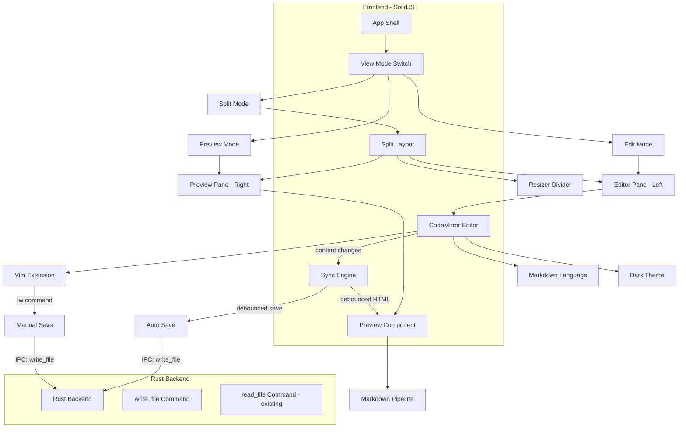
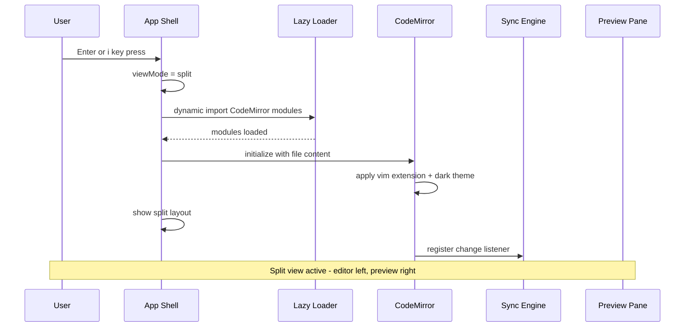
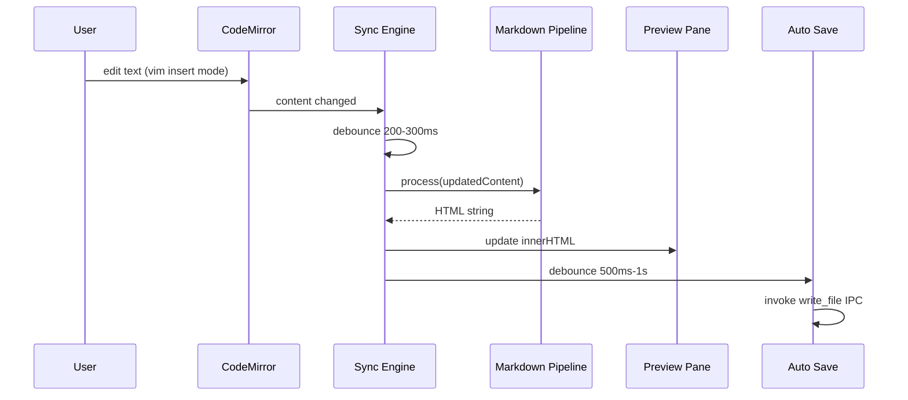
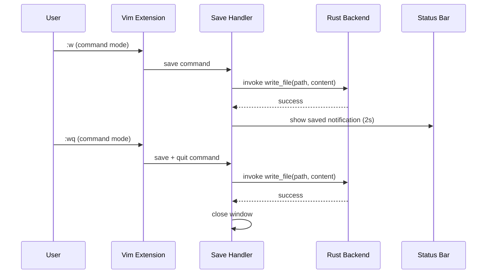
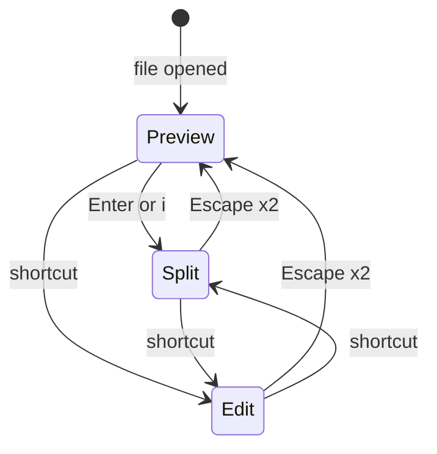

# Design Document: inline-edit

## Overview

**Purpose**: ターミナルAI開発者が、プレビュー表示を維持しながらVimキーバインドでMarkdownをその場で編集できる体験を提供する。Split view（エディタ左 + プレビュー右）を中心に、CodeMirror 6 + vim extension による本格的な編集環境を実現する。
**Users**: Claude Code + Ghostty 等でターミナル完結の開発を行うユーザーが、CLAUDE.md / spec / plan 等のMarkdownファイルを読みながら編集する用途で使用する。
**Impact**: `instant-read` の読み取り専用体験を拡張し、読み書き一体の編集体験を新規構築する。既存の Preview / MarkdownPipeline / App シェルを再利用し、エディタ層とファイル書き込み機能を追加する。

### Goals
- Split view でエディタとプレビューを横並び表示し、リアルタイム同期
- CodeMirror 6 + vim extension による完全なVim操作体験
- `:w` による手動保存とデバウンス付き auto-save
- Preview / Edit / Split の3モード切替
- CodeMirror の遅延ロードで Preview モード起動時のパフォーマンスを維持

### Non-Goals
- エディタ ⇔ プレビュー間のスクロール同期 -- v0.2以降で検討
- インライン編集モード（プレビュー上で直接編集） -- 複雑度が高いため Split view 優先
- 複数ファイルタブ / バッファ切替 -- v0.2以降
- Vim キーバインドのカスタマイズ UI -- v0.2以降
- LSP / 補完 / Linting -- 別 feature
- mermaid / KaTeX のリアルタイムプレビュー -- v0.2以降

## Architecture

### Existing Architecture Analysis
`instant-read` で構築済みの以下を拡張する:
- **App シェル**: `viewMode` Signal に `'edit'` / `'split'` を追加
- **Preview コンポーネント**: Split view 右ペインとして再利用
- **MarkdownPipeline**: エディタからのリアルタイム入力をパイプラインに流す
- **read_file IPC**: 既存のまま利用。新規に `write_file` IPC を追加
- **KeyboardHandler**: `:q` 処理を拡張し `:w` / `:wq` に対応

### Architecture Pattern & Boundary Map



**Architecture Integration**:
- **Selected pattern**: Thin Backend + Rich Frontend -- Rust は `write_file` IPC コマンドのみ追加。エディタ、同期、モード管理は全て SolidJS 側
- **Frontend/Backend boundaries**: Rust = ファイル書き込み / SolidJS = CodeMirror 管理、vim mode、リアルタイム同期、モード切替、auto-save ロジック
- **IPC contract**: 既存 `read_file` に加え、`write_file` コマンドでファイル書き込み
- **Existing patterns preserved**: `instant-read` の Preview / MarkdownPipeline / App シェルをそのまま拡張。CLAUDE.md の「Rust 側は最小限」方針に準拠

### Technology Stack

| Layer | Choice / Version | Role in Feature | Notes |
|-------|------------------|-----------------|-------|
| Editor | CodeMirror 6 (@codemirror/view, @codemirror/state) | テキストエディタコア | 拡張可能なモダンエディタ |
| Vim Mode | @replit/codemirror-vim 6.x | Vimキーバインド | `jk` escape デフォルト対応 |
| Markdown Syntax | @codemirror/lang-markdown | エディタ内MDハイライト | |
| Editor Theme | @codemirror/theme-one-dark | ダークテーマ | カスタマイズ可能 |
| Frontend | SolidJS 1.9+ / TypeScript 5.x | UI、状態管理、同期ロジック | 既存 |
| Markdown | unified 11 / remark ecosystem | リアルタイムプレビュー変換 | 既存 |
| Styling | Tailwind CSS 3.x | Split layout、リサイザー | 既存 |
| Backend | Rust / Tauri v2.10 | ファイル書き込み IPC | 最小限の追加 |
| Build | bun / Vite | 遅延ロード、コード分割 | dynamic import |

## System Flows

### Flow 1: Preview から Split view への切替



### Flow 2: リアルタイム編集 + プレビュー同期



### Flow 3: Vim コマンドによるファイル保存



### Flow 4: 表示モード切替



## Requirements Traceability

| Requirement | Summary | Components | Interfaces | Flows |
|-------------|---------|------------|------------|-------|
| 1.1 | Split view 横並び表示 | SplitLayout, EditorPane, PreviewPane | - | Flow 1 |
| 1.2 | リサイザーでペイン幅変更 | SplitLayout, Resizer | - | - |
| 1.3 | エディタ変更のリアルタイムプレビュー反映 | SyncEngine, MarkdownPipeline, Preview | - | Flow 2 |
| 1.4 | ウィンドウリサイズ時のペイン比率維持 | SplitLayout | - | - |
| 1.5 | デフォルト 50:50 ペイン比率 | SplitLayout | - | - |
| 2.1 | CodeMirror 6 でファイル内容表示 | EditorPane, CMEditor | - | Flow 1 |
| 2.2 | Markdown シンタックスハイライト | CMEditor, MDLang extension | - | - |
| 2.3 | 行番号表示 | CMEditor | - | - |
| 2.4 | エディタ ダークテーマ | CMEditor, DarkTheme extension | - | - |
| 2.5 | カーソル位置表示 | StatusBar | - | - |
| 3.1 | Vim キーバインドデフォルト有効 | VimExtension | - | - |
| 3.2 | Vim motions でカーソル移動 | VimExtension | - | - |
| 3.3 | i/a/o/A/O でインサートモード | VimExtension | - | - |
| 3.4 | jk でノーマルモード | VimExtension | - | - |
| 3.5 | テキスト操作 (dd, yy, p 等) | VimExtension | - | - |
| 3.6 | Vim モード表示 | StatusBar, VimExtension | - | - |
| 3.7 | :q でウィンドウを閉じる | VimExtension, KeyboardHandler | - | - |
| 4.1 | :w で即座保存 | VimExtension, SaveHandler | IPC: write_file | Flow 3 |
| 4.2 | :wq で保存後ウィンドウ閉じる | VimExtension, SaveHandler | IPC: write_file | Flow 3 |
| 4.3 | auto-save (デバウンス) | AutoSaveHandler, SyncEngine | IPC: write_file | Flow 2 |
| 4.4 | 保存成功通知 | StatusBar | - | Flow 3 |
| 4.5 | 保存失敗エラー表示 | StatusBar, ErrorDisplay | - | - |
| 4.6 | 未保存インジケーター | StatusBar | - | - |
| 5.1 | 3モード提供 | App, ViewModeSwitch | - | Flow 4 |
| 5.2 | ショートカットでモード切替 | KeyboardHandler, App | - | Flow 4 |
| 5.3 | デフォルト Preview モード | App | - | - |
| 5.4 | Enter/i で Split モード | KeyboardHandler, App | - | Flow 1, Flow 4 |
| 5.5 | Escape x2 で Preview モード | KeyboardHandler, App | - | Flow 4 |
| 6.1 | Preview 起動時 CM 非ロード | LazyLoader | - | - |
| 6.2 | 初回切替時に CM 非同期ロード | LazyLoader | - | Flow 1 |
| 6.3 | ロード中インジケーター | LazyLoader, LoadingIndicator | - | Flow 1 |
| 6.4 | ロード後の即座切替 | LazyLoader, App | - | - |
| 7.1 | デバウンス付きプレビュー同期 | SyncEngine, MarkdownPipeline | - | Flow 2 |
| 7.2 | プレビュー更新時のちらつき防止 | SyncEngine, Preview | - | - |
| 7.3 | パース失敗時の最終成功プレビュー維持 | SyncEngine, Preview | - | - |

## Components and Interfaces

| Component | Domain/Layer | Intent | Req Coverage | Key Dependencies | Contracts |
|-----------|------------|--------|--------------|------------------|-----------|
| App (拡張) | Frontend | viewMode に edit/split 追加 | 5.1-5.5 | SolidJS | State |
| SplitLayout | Frontend | 左右ペイン + リサイザーレイアウト | 1.1-1.5 | App | - |
| EditorPane | Frontend | CodeMirror のホスティング | 2.1-2.5 | SplitLayout, CMEditor | - |
| CMEditor | Frontend | CodeMirror 6 初期化・管理 | 2.1-2.5, 3.1-3.6 | CodeMirror, vim ext | Service |
| VimExtension | Frontend | Vim mode 設定・コマンド拡張 | 3.1-3.7, 4.1-4.2 | @replit/codemirror-vim | Event |
| SyncEngine | Frontend | エディタ→プレビュー同期 | 7.1-7.3 | CMEditor, MarkdownPipeline | Service |
| AutoSaveHandler | Frontend | デバウンス付き自動保存 | 4.3, 4.6 | write_file IPC | Service |
| StatusBar | Frontend | Vim モード、カーソル位置、保存状態表示 | 2.5, 3.6, 4.4-4.6 | App | - |
| LazyLoader | Frontend | CodeMirror の動的インポート | 6.1-6.4 | Vite dynamic import | Service |
| ViewModeSwitch | Frontend | モード切替ロジック | 5.1-5.5 | App, KeyboardHandler | Event |
| write_file | Backend/IPC | ファイル書き込み | 4.1-4.3, 4.5 | Tauri fs | IPC Command |
| Preview (既存) | Frontend | HTML プレビュー表示 | 1.3, 7.1-7.3 | MarkdownPipeline | - |
| MarkdownPipeline (既存) | Frontend | MD→HTML 変換 | 7.1 | unified, remark | Service |
| KeyboardHandler (拡張) | Frontend | モード切替ショートカット | 5.2, 5.4, 5.5 | App | Event |

### Backend - Rust

#### write_file

| Field | Detail |
|-------|--------|
| Intent | 指定パスにファイル内容を書き込む |
| Requirements | 4.1, 4.2, 4.3, 4.5 |

**Responsibilities & Constraints**
- 指定パスにテキストを UTF-8 で書き込む
- 書き込み先ファイルの存在確認（上書き）
- アトミック書き込み（一時ファイル→リネーム）で書き込み途中のクラッシュに対応
- エラー時は構造化エラーを返す（権限不足、ディスク容量不足等）

**Dependencies**
- Inbound: Frontend SaveHandler / AutoSaveHandler -- ファイル保存要求 (Critical)
- Outbound: OS FileSystem -- ファイル書き込み (Critical)

**Contracts**: IPC Command

##### IPC Command Contract
```typescript
// TypeScript side
interface WriteFileResult {
  bytes_written: number;
}

invoke<WriteFileResult>('write_file', { path: string, content: string }): Promise<WriteFileResult>
```
```rust
// Rust side
#[derive(serde::Serialize)]
struct WriteFileResult {
    bytes_written: u64,
}

#[tauri::command]
fn write_file(path: String, content: String) -> Result<WriteFileResult, String> { }
```

### Frontend - SolidJS

#### App (拡張)

| Field | Detail |
|-------|--------|
| Intent | viewMode を拡張し、Preview / Edit / Split の3モードを管理する |
| Requirements | 5.1-5.5 |

**Responsibilities & Constraints**
- `viewMode` Signal を `'preview' | 'edit' | 'split' | 'file-list' | 'error'` に拡張
- モード切替時の状態遷移管理
- エディタ初期化状態の追跡

**Dependencies**
- Outbound: SplitLayout -- Split view 表示 (Critical)
- Outbound: EditorPane -- Edit view 表示 (Critical)
- Outbound: Preview -- Preview 表示 (Critical, 既存)
- Outbound: LazyLoader -- CodeMirror 遅延ロード (Critical)

##### State Management
- `viewMode: Signal<'preview' | 'edit' | 'split' | 'file-list' | 'error'>` -- 表示モード（既存を拡張）
- `editorContent: Signal<string>` -- エディタの現在のテキスト内容
- `isDirty: Signal<boolean>` -- 未保存変更の有無
- `vimMode: Signal<'NORMAL' | 'INSERT' | 'VISUAL' | 'COMMAND'>` -- 現在のVimモード
- `cursorPosition: Signal<{ line: number; col: number }>` -- カーソル位置
- `editorLoaded: Signal<boolean>` -- CodeMirror ロード完了フラグ

#### SplitLayout

| Field | Detail |
|-------|--------|
| Intent | 左右2ペインとリサイザーで構成されるレイアウトコンポーネント |
| Requirements | 1.1, 1.2, 1.4, 1.5 |

**Responsibilities & Constraints**
- CSS Flexbox で左ペイン（エディタ）+ リサイザー + 右ペイン（プレビュー）を配置
- リサイザーのドラッグでペイン幅を変更（PointerEvent ベース）
- ペイン幅を Signal で管理し、ウィンドウリサイズ時は比率維持
- 最小ペイン幅の制約（各ペイン最低 200px 等）

**Dependencies**
- Inbound: App -- Split view 表示要求 (Critical)
- Outbound: EditorPane -- 左ペイン子要素 (Critical)
- Outbound: Preview -- 右ペイン子要素 (Critical)

#### EditorPane

| Field | Detail |
|-------|--------|
| Intent | CodeMirror 6 エディタのホスティングと初期化 |
| Requirements | 2.1-2.5 |

**Responsibilities & Constraints**
- CodeMirror EditorView の作成とDOMへのマウント
- ファイル内容の初期セットと外部変更への追従
- Cleanup（EditorView の destroy）

**Dependencies**
- Inbound: SplitLayout / App -- エディタ表示領域 (Critical)
- Outbound: CMEditor -- CodeMirror 初期化・管理 (Critical)

#### CMEditor

| Field | Detail |
|-------|--------|
| Intent | CodeMirror 6 の設定と拡張管理サービス |
| Requirements | 2.1-2.5, 3.1-3.6 |

**Responsibilities & Constraints**
- 拡張の組み立て: vim mode, markdown language, dark theme, line numbers, cursor position listener
- EditorState / EditorView の生成
- Vim mode のイベント（モード変更、コマンド実行）をコールバックで外部に通知
- コンテンツ変更のリスナー登録

**Dependencies**
- Inbound: EditorPane -- エディタ初期化・管理 (Critical)
- Outbound: @codemirror/view, @codemirror/state -- CodeMirror コア (Critical)
- Outbound: @replit/codemirror-vim -- Vim mode (Critical)
- Outbound: @codemirror/lang-markdown -- MD ハイライト (Critical)
- Outbound: @codemirror/theme-one-dark -- テーマ

**Contracts**: Service

```typescript
interface CMEditorConfig {
  initialContent: string;
  onContentChange: (content: string) => void;
  onVimModeChange: (mode: 'NORMAL' | 'INSERT' | 'VISUAL' | 'COMMAND') => void;
  onCursorChange: (pos: { line: number; col: number }) => void;
  onSaveCommand: () => void;       // :w
  onSaveQuitCommand: () => void;   // :wq
  onQuitCommand: () => void;       // :q
}

interface CMEditorInstance {
  getContent(): string;
  setContent(content: string): void;
  focus(): void;
  destroy(): void;
}

function createCMEditor(parent: HTMLElement, config: CMEditorConfig): CMEditorInstance;
```

#### VimExtension

| Field | Detail |
|-------|--------|
| Intent | @replit/codemirror-vim の設定とカスタムExコマンド登録 |
| Requirements | 3.1-3.7, 4.1, 4.2 |

**Responsibilities & Constraints**
- `Vim.defineEx` で `:w`, `:wq`, `:q` コマンドを登録
- `jk` escape はデフォルトで有効（@replit/codemirror-vim の標準機能）
- Vim mode 変更イベントのフック

**Dependencies**
- Inbound: CMEditor -- Vim 設定要求 (Critical)
- Outbound: @replit/codemirror-vim -- Vim 実装 (Critical)

#### SyncEngine

| Field | Detail |
|-------|--------|
| Intent | エディタの変更をデバウンスしてプレビューとauto-saveに伝播 |
| Requirements | 7.1-7.3, 4.3 |

**Responsibilities & Constraints**
- エディタ内容変更を受け取り、デバウンス（200-300ms）して MarkdownPipeline に送る
- パース成功時は HTML を Preview に反映、失敗時は最終成功結果を維持
- auto-save 用に別のデバウンス（500ms-1s）で write_file IPC を呼び出す
- パース失敗時もエディタ内容は保持

**Dependencies**
- Inbound: CMEditor -- コンテンツ変更通知 (Critical)
- Outbound: MarkdownPipeline -- MD→HTML 変換 (Critical)
- Outbound: Preview -- HTML 更新 (Critical)
- Outbound: write_file IPC -- auto-save (Important)

**Contracts**: Service

```typescript
interface SyncEngineConfig {
  previewDebounceMs: number;  // 200-300ms
  autoSaveDebounceMs: number; // 500-1000ms
  filePath: string;
  onPreviewUpdate: (html: string) => void;
  onSaveComplete: () => void;
  onSaveError: (error: string) => void;
  onDirtyChange: (isDirty: boolean) => void;
}

function createSyncEngine(config: SyncEngineConfig): {
  handleContentChange(content: string): void;
  forcePreviewUpdate(): void;
  forceSave(): Promise<void>;
  destroy(): void;
};
```

#### AutoSaveHandler

| Field | Detail |
|-------|--------|
| Intent | デバウンス付きの自動保存ロジック |
| Requirements | 4.3, 4.6 |

**Responsibilities & Constraints**
- 最後の変更から 500ms-1s 後に自動保存をトリガー
- 保存中は追加の保存要求をキューイング
- 保存完了/失敗をコールバックで通知
- `isDirty` 状態の管理

**Dependencies**
- Inbound: SyncEngine -- 保存トリガー (Critical)
- Outbound: write_file IPC -- ファイル書き込み (Critical)

#### StatusBar

| Field | Detail |
|-------|--------|
| Intent | Vim モード、カーソル位置、保存状態を表示するバー |
| Requirements | 2.5, 3.6, 4.4, 4.5, 4.6 |

**Responsibilities & Constraints**
- 左側: Vim モード表示（NORMAL / INSERT / VISUAL）
- 中央: 保存状態通知（一時的メッセージ）
- 右側: カーソル位置（行:列）、未保存インジケーター
- 保存成功通知は 2 秒後にフェードアウト

**Dependencies**
- Inbound: App -- 状態 Signal (Critical)

#### LazyLoader

| Field | Detail |
|-------|--------|
| Intent | CodeMirror モジュール群の動的インポート管理 |
| Requirements | 6.1-6.4 |

**Responsibilities & Constraints**
- `import()` で CodeMirror 関連モジュールを一括ロード
- ロード状態（idle / loading / loaded / error）の管理
- ロード完了後はキャッシュを保持し再ロード不要
- ロード中のインジケーター表示制御

**Dependencies**
- Inbound: App -- ロード要求 (Critical)
- Outbound: @codemirror/* packages -- 動的インポート (Critical)

**Contracts**: Service

```typescript
type LoaderState = 'idle' | 'loading' | 'loaded' | 'error';

interface LazyLoaderResult {
  state: Accessor<LoaderState>;
  load(): Promise<void>;
  getModules(): CodeMirrorModules | null;
}

function createEditorLazyLoader(): LazyLoaderResult;
```

#### ViewModeSwitch

| Field | Detail |
|-------|--------|
| Intent | 表示モード切替のロジックとキーボードハンドリング |
| Requirements | 5.1-5.5 |

**Responsibilities & Constraints**
- Preview モードで `Enter` / `i` 押下時に Split モード遷移 + エディタフォーカス
- `Escape` 2回連続で Preview モード遷移
- キーボードショートカットでの3モード切替
- CodeMirror がフォーカスされている場合はモード切替ショートカットを無視（Vim操作優先）

**Dependencies**
- Inbound: App -- モード切替要求 (Critical)
- Outbound: App viewMode Signal -- 状態更新 (Critical)
- Outbound: LazyLoader -- エディタ初回ロードトリガー (Critical)

## Error Handling

### Error Strategy
- Rust 側: `Result<WriteFileResult, String>` で IPC エラーを返す
- Frontend: 保存エラーは StatusBar に表示、編集内容は破棄しない
- パースエラー: 最終成功プレビューを維持し、エディタ内容はそのまま保持
- CodeMirror ロードエラー: リトライボタン付きのエラー表示

### Error Categories

| Category | Trigger | Response | Req |
|----------|---------|----------|-----|
| Save Error | ファイル書き込み権限不足 | StatusBar にエラー表示、編集内容保持 | 4.5 |
| Save Error | ディスク容量不足 | StatusBar にエラー表示、編集内容保持 | 4.5 |
| Parse Error | 不正な Markdown 構文 | 最終成功プレビューを維持 | 7.3 |
| Load Error | CodeMirror モジュールロード失敗 | リトライ可能なエラー表示 | 6.3 |
| IPC Error | write_file コマンド失敗 | リトライ 1 回 → StatusBar エラー表示 | 4.5 |

## Testing Strategy

### Unit Tests
- **SyncEngine**: デバウンスタイミング、パース失敗時のフォールバック動作
- **AutoSaveHandler**: デバウンス、保存キューイング、isDirty 状態管理
- **LazyLoader**: ロード状態遷移、キャッシュ動作
- **ViewModeSwitch**: モード遷移ロジック、Escape 2回検知

### Integration Tests
- **IPC round-trip**: `write_file` コマンドの正常系・異常系（権限不足、不存在パス）
- **CodeMirror + Vim**: vim extension のコマンド登録、`:w` / `:wq` / `:q` の動作
- **SyncEngine + MarkdownPipeline**: エディタ変更→HTML生成→プレビュー反映の一連

### E2E Tests
- **Split view 表示**: ファイルを開く→Split mode→エディタ+プレビュー表示確認
- **Vim 編集→保存**: テキスト編集→`:w`→ファイル内容確認
- **auto-save**: テキスト編集→一定時間待機→ファイル内容確認
- **モード切替**: Preview→`i`→Split→Escape x2→Preview
- **リアルタイム同期**: エディタで編集→プレビューに反映確認

## Security Considerations

- **Tauri allowlist**: ファイル書き込みは `fs:write-files` スコープに追加（既存の `fs:read-files` に加えて）
- **書き込みパス検証**: パストラバーサル防止（Rust 側で正規化、許可ディレクトリ外への書き込み拒否）
- **アトミック書き込み**: 一時ファイル→リネームで書き込み途中の破損を防止
- **既存セキュリティの維持**: `instant-read` の HTML サニタイズ、外部リンク処理はそのまま維持

## Performance & Scalability

- **CodeMirror 遅延ロード**: Preview モード起動時は CodeMirror をロードしない。初回 Edit/Split 切替時に `import()` でロード（約 200-300KB gzipped）
- **プレビュー同期デバウンス**: 200-300ms のデバウンスで過剰なパース処理を防止
- **auto-save デバウンス**: 500ms-1s のデバウンスで過剰なファイル書き込みを防止
- **アトミック書き込み**: 一時ファイル→リネームで I/O パフォーマンスと安全性を両立
- **大ファイル**: `instant-read` のチャンク処理を活用。エディタ側は CodeMirror 6 のネイティブ仮想化で対応
- **バンドルサイズ**: CodeMirror 関連モジュールはコード分割チャンクに分離し初期バンドルに含めない
