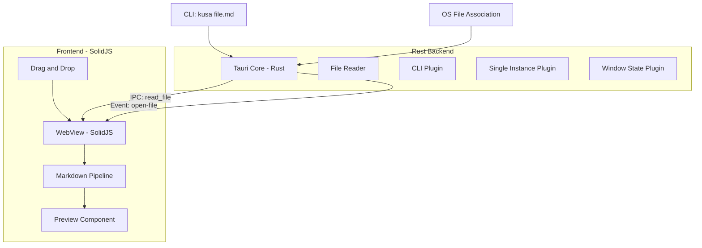
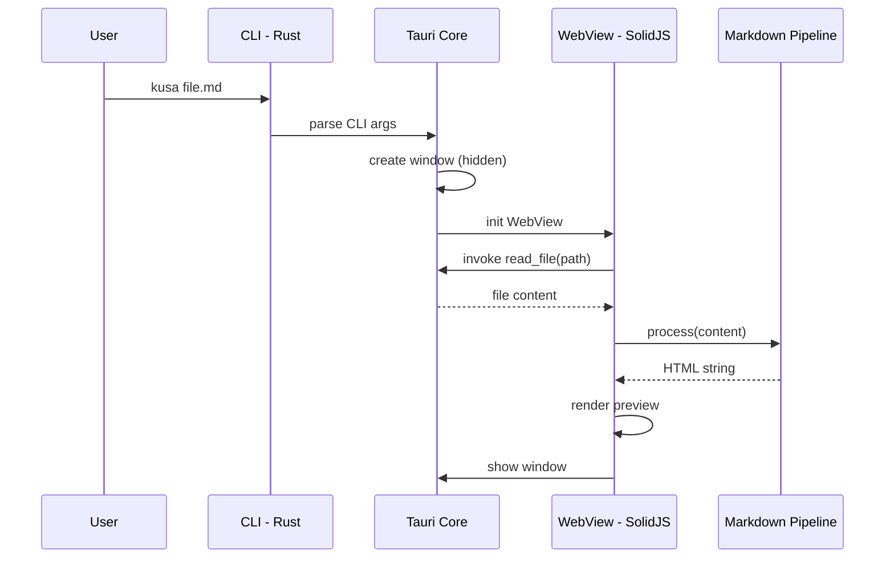
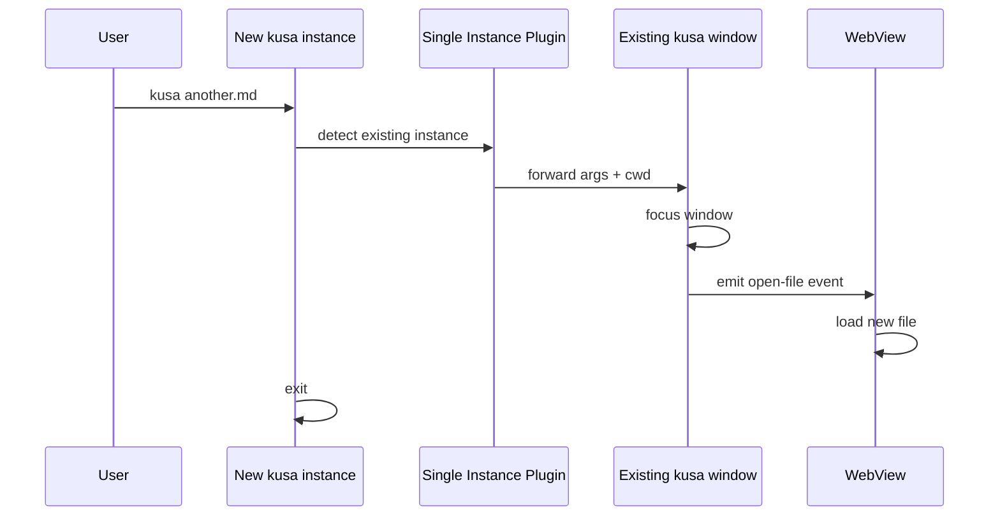
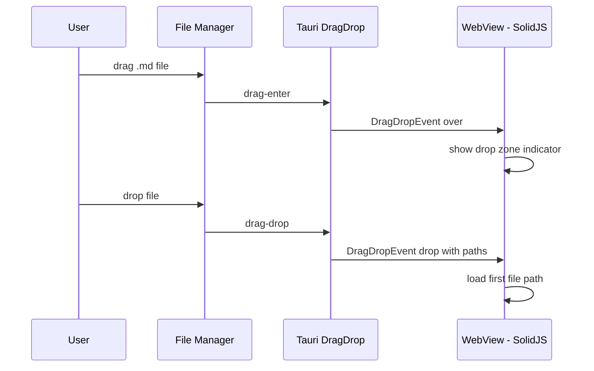

# Design Document: instant-read

## Overview

**Purpose**: ターミナルAI開発者が、CLIから即座にMarkdownファイルを美しくプレビュー表示する体験を提供する。
**Users**: Claude Code + Ghostty 等でターミナル完結の開発を行うユーザーが、生成されたMDの確認に使用する。
**Impact**: VS Codeを開くことなく、ターミナルワークフローを中断せずにMarkdownを読める環境を新規構築する。

### Goals
- CLI引数 / D&D / ファイルリンクからMDファイルを即座にプレビュー表示
- 200ms以内のウィンドウ表示（体感起動速度）
- GFM + シンタックスハイライトによる美しいレンダリング
- 単一ウィンドウ・軽量・邪魔にならない存在

### Non-Goals
- エディタ機能（CodeMirror / vim mode）— 別spec `inline-edit` で対応
- パイプ入力 / クリップボード / URL入力 — 別spec `universal-input` で対応
- TOC / アウトライン / 見出しジャンプ — 別spec `reading-support` で対応
- peek / popup 表示 — 別spec `lightweight-access` で対応
- mermaid / KaTeX レンダリング — v0.2以降
- 複数ファイルタブ — v0.2以降

## Architecture

### Architecture Pattern & Boundary Map



**Architecture Integration**:
- **Selected pattern**: Thin Backend + Rich Frontend — Rust はファイルI/O と OS 連携のみ、UIロジックは全て SolidJS
- **Frontend/Backend boundaries**: Rust = ファイル読み取り・CLI解析・OS統合 / SolidJS = MD パース・レンダリング・UI状態管理
- **IPC contract**: `read_file` コマンドでファイル内容を取得、`open-file` イベントでファイルパスを通知
- **Existing patterns preserved**: CLAUDE.md の「Rust側は最小限」方針に準拠

### Technology Stack

| Layer | Choice / Version | Role in Feature | Notes |
|-------|------------------|-----------------|-------|
| Frontend | SolidJS 1.9+ / TypeScript 5.x | UI、状態管理、MDレンダリング | 細粒度リアクティビティ |
| Markdown | unified 11 / remark-parse 11 / remark-gfm 4 | GFM パース | フロントエンド処理 |
| HTML Transform | remark-rehype 11 / rehype-stringify 10 | mdast → HTML 変換 | |
| Syntax Highlight | rehype-pretty-code 0.14 / shiki 1.x | コードブロックハイライト | github-dark テーマ |
| Styling | Tailwind CSS 3.x | レイアウト、タイポグラフィ | ダークテーマデフォルト |
| Backend | Rust / Tauri v2.10 | ファイルI/O、CLI、OS連携 | 最小限の責務 |
| Plugins | cli, single-instance, window-state | CLI引数、単一インスタンス、ウィンドウ永続化 | 公式プラグイン |
| Build | bun / Vite | バンドル、開発サーバー | Tree shaking有効 |

## System Flows

### Flow 1: CLI起動 → プレビュー表示



### Flow 2: 単一インスタンス再利用



### Flow 3: ドラッグ&ドロップ



## Requirements Traceability

| Requirement | Summary | Components | Interfaces | Flows |
|-------------|---------|------------|------------|-------|
| 1.1 | CLI ファイル指定起動 | CLIParser, App, Preview | IPC: read_file | Flow 1 |
| 1.2 | CLI ディレクトリ指定 | CLIParser, FileList | IPC: list_md_files | - |
| 1.3 | CLI 引数なし起動 | CLIParser, FileList | IPC: list_md_files | - |
| 1.4 | ファイル不存在エラー | CLIParser, ErrorDisplay | IPC: read_file Error | - |
| 1.5 | 非MDファイル表示 | App, Preview | IPC: read_file | - |
| 2.1 | 200ms起動 | App, Window Config | - | Flow 1 |
| 2.2 | Tauri v2 アーキテクチャ | 全コンポーネント | - | - |
| 2.3 | 大ファイル非同期レンダリング | MarkdownPipeline, Preview | - | - |
| 3.1 | D&D でファイル表示 | DragDropHandler, Preview | Tauri DragDrop Event | Flow 3 |
| 3.2 | 複数D&D で最初のファイル | DragDropHandler | Tauri DragDrop Event | Flow 3 |
| 3.3 | 非MD D&D でプレーンテキスト | DragDropHandler, Preview | Tauri DragDrop Event | - |
| 4.1 | OS ファイル関連付け | Bundle Config | RunEvent::Opened | - |
| 4.2 | ファイルリンクから起動 | App | RunEvent::Opened | - |
| 5.1 | GFM レンダリング | MarkdownPipeline | - | - |
| 5.2 | シンタックスハイライト | MarkdownPipeline (Shiki) | - | - |
| 5.3 | ダークテーマデフォルト | ThemeProvider, CSS | - | - |
| 5.4 | 基本MD要素レンダリング | MarkdownPipeline | - | - |
| 5.5 | 読みやすさ最適化 | Preview CSS | - | - |
| 6.1 | 単一ウィンドウ表示 | Window Config | - | - |
| 6.2 | Cmd+W / :q で閉じる | KeyboardHandler | - | - |
| 6.3 | 既存ウィンドウ再利用 | SingleInstance Plugin | Event: open-file | Flow 2 |
| 6.4 | ウィンドウ状態復元 | WindowState Plugin | - | - |

## Components and Interfaces

| Component | Domain/Layer | Intent | Req Coverage | Key Dependencies | Contracts |
|-----------|------------|--------|--------------|------------------|-----------|
| App | Frontend | アプリケーションルート、状態管理 | 1.1-1.5, 6.1-6.3 | SolidJS | State |
| Preview | Frontend | MDのHTML表示 | 5.1-5.5, 2.3 | MarkdownPipeline | - |
| MarkdownPipeline | Frontend | MD→HTML変換 | 5.1-5.4, 2.3 | unified, remark, rehype, shiki | Service |
| FileList | Frontend | MDファイル一覧表示 | 1.2, 1.3 | App | - |
| DragDropHandler | Frontend | D&Dイベント処理 | 3.1-3.3 | Tauri WebView API | Event |
| KeyboardHandler | Frontend | キーボードショートカット | 6.2 | - | Event |
| ThemeProvider | Frontend | ダークテーマ管理 | 5.3 | Tailwind CSS | State |
| ErrorDisplay | Frontend | エラーメッセージ表示 | 1.4 | App | - |
| read_file | Backend/IPC | ファイル読み取り | 1.1, 1.5 | Tauri fs | IPC Command |
| list_md_files | Backend/IPC | ディレクトリ内MD一覧 | 1.2, 1.3 | Tauri fs | IPC Command |

### Backend - Rust

#### read_file

| Field | Detail |
|-------|--------|
| Intent | 指定パスのファイル内容を文字列として読み取る |
| Requirements | 1.1, 1.4, 1.5 |

**Responsibilities & Constraints**
- ファイルの存在確認とテキスト読み取り
- エラー時は構造化エラーを返す

**Dependencies**
- Inbound: Frontend App — ファイル表示要求 (Critical)
- Outbound: OS FileSystem — ファイル読み取り (Critical)

**Contracts**: IPC Command

##### IPC Command Contract
```typescript
// TypeScript side
invoke<string>('read_file', { path: string }): Promise<string>
```
```rust
// Rust side
#[tauri::command]
fn read_file(path: String) -> Result<String, String> { }
```

#### list_md_files

| Field | Detail |
|-------|--------|
| Intent | 指定ディレクトリ内の .md ファイル一覧を返す |
| Requirements | 1.2, 1.3 |

**Responsibilities & Constraints**
- ディレクトリ走査、.md/.markdown 拡張子フィルタ
- ファイル名、パス、更新日時を返す

**Dependencies**
- Inbound: Frontend FileList — ファイル一覧要求 (Critical)
- Outbound: OS FileSystem — ディレクトリ読み取り (Critical)

**Contracts**: IPC Command

##### IPC Command Contract
```typescript
// TypeScript side
interface MdFileEntry {
  name: string;
  path: string;
  modified_at: number; // Unix timestamp
  size: number; // bytes
}

invoke<MdFileEntry[]>('list_md_files', { dirPath: string }): Promise<MdFileEntry[]>
```
```rust
// Rust side
#[derive(serde::Serialize)]
struct MdFileEntry {
    name: String,
    path: String,
    modified_at: u64,
    size: u64,
}

#[tauri::command]
fn list_md_files(dir_path: String) -> Result<Vec<MdFileEntry>, String> { }
```

### Frontend - SolidJS

#### App

| Field | Detail |
|-------|--------|
| Intent | アプリケーションルート。表示状態の管理とルーティング |
| Requirements | 1.1-1.5, 6.1-6.3 |

**Responsibilities & Constraints**
- 現在表示中のファイルパスを Signal で管理
- `open-file` イベントのリッスンとファイル切替
- 表示モードの切替（プレビュー / ファイル一覧 / エラー）

**Dependencies**
- Outbound: Preview — プレビュー表示 (Critical)
- Outbound: FileList — ファイル一覧表示
- Outbound: ErrorDisplay — エラー表示
- Outbound: read_file IPC — ファイル読み取り (Critical)

##### State Management
- `currentFilePath: Signal<string | null>` — 現在表示中のファイルパス
- `fileContent: Resource<string>` — ファイル内容（createResource で IPC と連動）
- `viewMode: Signal<'preview' | 'file-list' | 'error'>` — 表示モード

#### MarkdownPipeline

| Field | Detail |
|-------|--------|
| Intent | Markdown 文字列を HTML 文字列に変換するサービス |
| Requirements | 5.1-5.4, 2.3 |

**Responsibilities & Constraints**
- unified パイプラインの初期化と実行
- GFM 拡張の適用
- Shiki によるシンタックスハイライト
- 大ファイル時のチャンク処理

**Dependencies**
- Inbound: App/Preview — MD 変換要求 (Critical)
- Outbound: unified, remark-parse, remark-gfm, remark-rehype, rehype-pretty-code, rehype-stringify — MD 処理 (Critical)

**Contracts**: Service

```typescript
// Service interface
interface MarkdownPipelineService {
  /** Markdown文字列をHTML文字列に変換 */
  process(markdown: string): Promise<string>;

  /** 大ファイル用: チャンク分割で段階的に変換 */
  processChunked(markdown: string, onChunk: (html: string) => void): Promise<void>;
}
```

#### Preview

| Field | Detail |
|-------|--------|
| Intent | 変換済み HTML を美しく表示するコンポーネント |
| Requirements | 5.1-5.5, 2.3 |

**Responsibilities & Constraints**
- HTML 文字列の安全なレンダリング（XSS対策）
- タイポグラフィ、行間、マージンの最適化
- スクロール位置管理

**Dependencies**
- Inbound: App — HTML 文字列 (Critical)

#### DragDropHandler

| Field | Detail |
|-------|--------|
| Intent | Tauri D&D イベントを処理し、ファイルパスを App に通知 |
| Requirements | 3.1-3.3 |

**Responsibilities & Constraints**
- Tauri `onDragDropEvent` のリッスン
- ドロップゾーン UI の表示/非表示
- ファイル拡張子の判定（.md かどうか）
- 複数ファイルドロップ時は最初のファイルを選択

**Dependencies**
- Inbound: Tauri WebView — DragDrop イベント (Critical)
- Outbound: App — ファイルパス通知 (Critical)

#### KeyboardHandler

| Field | Detail |
|-------|--------|
| Intent | グローバルキーボードショートカットの処理 |
| Requirements | 6.2 |

**Responsibilities & Constraints**
- `Cmd+W` でウィンドウを閉じる
- `:q` 入力でウィンドウを閉じる（vim風）
- キーシーケンスの状態管理

**Dependencies**
- Outbound: Tauri Window API — ウィンドウ操作 (Critical)

## Error Handling

### Error Strategy
- Rust 側: `Result<T, String>` で IPC エラーを返す
- Frontend: エラーを ErrorDisplay コンポーネントで表示、操作可能な状態を維持
- ファイル監視エラーなど非致命的エラーはコンソールログのみ

### Error Categories

| Category | Trigger | Response | Req |
|----------|---------|----------|-----|
| User Error | 存在しないファイルパス | パスを含むエラーメッセージ表示 | 1.4 |
| User Error | 非MDファイル指定 | プレーンテキストとして表示 | 1.5, 3.3 |
| System Error | ファイル読み取り権限不足 | 権限エラーメッセージ + パス表示 | - |
| System Error | 大ファイルパース失敗 | 部分レンダリング + エラー通知 | 2.3 |
| IPC Error | Tauri コマンド失敗 | リトライ1回 → エラー表示 | - |

## Testing Strategy

### Unit Tests
- **MarkdownPipeline**: GFM各要素のパース・レンダリング結果検証
- **ファイル拡張子判定**: .md, .markdown, .txt 等のパターン

### Integration Tests
- **IPC round-trip**: `read_file` コマンドの正常系・異常系
- **IPC round-trip**: `list_md_files` コマンドの正常系・空ディレクトリ

### E2E Tests
- **CLI起動 → プレビュー表示**: `kusa test.md` → ウィンドウ表示 → 内容確認
- **D&D → プレビュー表示**: ファイルドロップ → 内容確認
- **エラーケース**: 存在しないファイル → エラーメッセージ表示

## Security Considerations

- **Tauri allowlist**: ファイル読み取りは `fs:read-files` スコープに制限
- **ファイルパス検証**: パストラバーサル防止（Rust 側で正規化）
- **HTML サニタイズ**: `rehype-sanitize` でレンダリングHTML内の危険な要素を除去
- **外部リンク**: `target="_blank"` + `rel="noopener noreferrer"`、`shell.open` でOSブラウザに委譲

## Performance & Scalability

- **起動速度**: Hidden window + 遅延UI初期化で 200ms 以内
- **大ファイル (1MB+)**: チャンク分割 + プログレッシブレンダリング
- **Shiki 遅延ロード**: 初回レンダリング時にWASMをロード、キャッシュで2回目以降高速化
- **メモリ**: 単一ファイル表示のため、ファイル切替時に前のコンテンツを破棄
- **バンドルサイズ**: Tree shaking + コード分割で初期ロードを最小化
