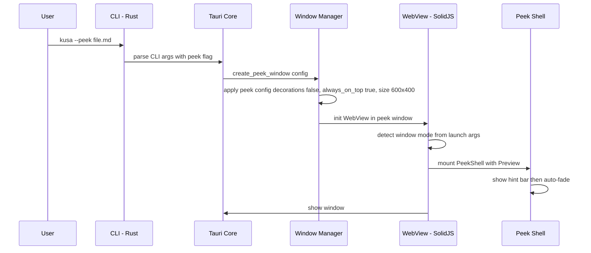
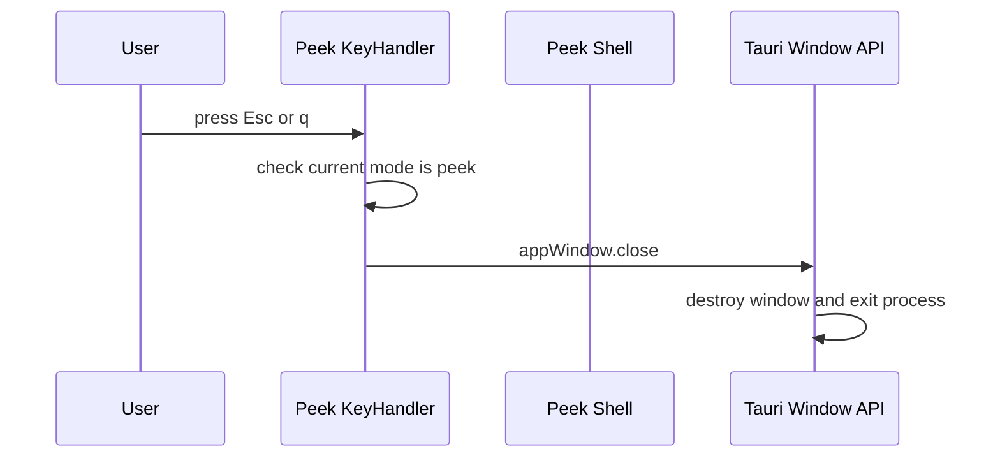
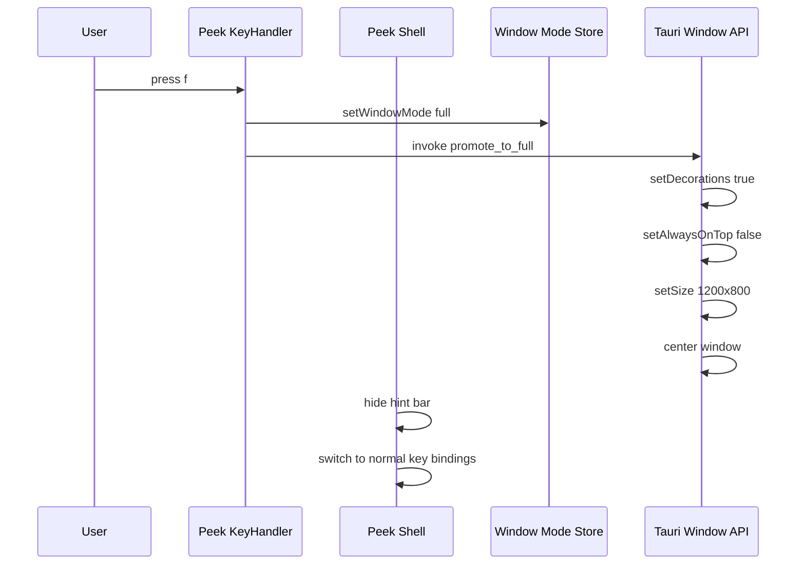
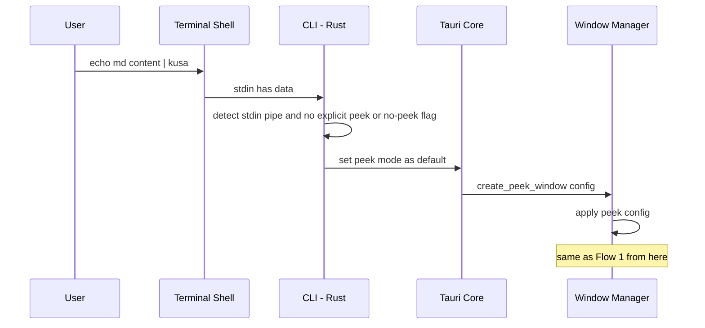
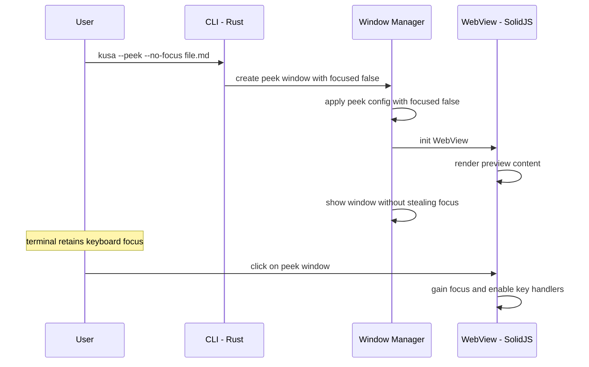

# Design Document: lightweight-access

## Overview

**Purpose**: ターミナルAI開発者が、Markdownを「ちょい見」したいときに軽量なpeek/popupウィンドウで即座に内容を確認し、Escで閉じて元の作業に戻れる体験を提供する。
**Users**: Claude Code + Ghostty 等でターミナル完結の開発を行うユーザーが、生成されたMDの内容確認やPR descriptionのチラ見に使用する。
**Impact**: 表示の「重さ」を選べるようにすることで、「ちょい見」と「じっくり読む」の体験を分離し、ターミナルワークフローへの復帰コストを最小化する。

### Goals
- `--peek` フラグによる小型overlay/popupウィンドウでの即時プレビュー
- Esc / q キーによるpeekウィンドウの即時クローズ
- peekモードからフルウィンドウへのシームレスな昇格
- パイプ入力時のデフォルトpeekモード（`universal-input` 連携）
- ターミナルのフォーカスを奪わない表示オプション

### Non-Goals
- ターミナル内インライン表示（将来検討。現時点ではTauri WebViewウィンドウのみ）
- peekモードでの編集機能 — 別spec `inline-edit` で対応
- peekウィンドウ内での複数ファイルタブ — v0.2以降
- peekウィンドウサイズのユーザー設定ファイルによるカスタマイズ — 初期はハードコードプリセットのみ
- パイプ入力の読み取り処理自体 — `universal-input` specの責務

## Architecture

### Architecture Pattern & Boundary Map

```mermaid
graph TB
    CLI_Peek[CLI: kusa --peek file.md]
    CLI_Pipe[Pipe: echo md | kusa]
    CLI_Full[CLI: kusa file.md]

    CLI_Peek --> TauriCore[Tauri Core - Rust]
    CLI_Pipe --> TauriCore
    CLI_Full --> TauriCore

    TauriCore -->|IPC: create_peek_window| WindowManager[Window Manager - Rust]
    TauriCore -->|IPC: promote_to_full| WindowManager
    TauriCore -->|Event: open-file| WebView[WebView - SolidJS]

    WindowManager --> PeekWindow[Peek Window Config]
    WindowManager --> FullWindow[Full Window Config]

    WebView --> PeekShell[Peek Shell Component]
    WebView --> AppShell[App Shell - existing]

    PeekShell --> PeekKeyHandler[Peek KeyHandler]
    PeekShell --> HintBar[Hint Bar Component]
    PeekShell --> Preview[Preview - existing]

    subgraph Rust Backend
        TauriCore
        WindowManager
        CLIParser[CLI Plugin - extended]
        PeekWindow
        FullWindow
    end

    subgraph Frontend - SolidJS
        WebView
        PeekShell
        PeekKeyHandler
        HintBar
        AppShell
        Preview
        WindowModeStore[Window Mode Store]
    end
```

**Architecture Integration**:
- **Selected pattern**: Thin Backend + Rich Frontend --- Rust はウィンドウ作成・サイズ変更・OS連携のみ、UIロジックとモード管理はSolidJS
- **Frontend/Backend boundaries**: Rust = ウィンドウ生成（サイズ・decorations・always_on_top・focus設定）、CLIフラグ解析 / SolidJS = peekモードUI、キーハンドリング、昇格ロジック、ヒントバー表示
- **IPC contract**: `create_peek_window` でpeekウィンドウ構成を適用、`promote_to_full` でフルウィンドウ構成に切り替え
- **Existing patterns preserved**: `instant-read` のPreviewコンポーネント、MarkdownPipeline、App シェルを再利用。CLI引数解析を拡張

### Technology Stack

| Layer | Choice / Version | Role in Feature | Notes |
|-------|------------------|-----------------|-------|
| Frontend | SolidJS 1.9+ / TypeScript 5.x | peekモードUI、状態管理、キーハンドリング | 既存App拡張 |
| Styling | Tailwind CSS 3.x | ヒントバー、角丸、シャドウ、フェードアニメーション | ダークテーマ前提 |
| Backend | Rust / Tauri v2.10 | ウィンドウ生成・構成変更、CLI拡張 | 最小限の責務 |
| Window API | Tauri WebviewWindowBuilder | peek/fullウィンドウの構成管理 | decorations, always_on_top, focused |
| Plugins | cli (extended), window-state, single-instance | CLI --peek フラグ、ウィンドウ永続化 | 既存プラグイン拡張 |
| Build | bun / Vite | バンドル、開発サーバー | 既存設定 |

## System Flows

### Flow 1: peekモード起動



### Flow 2: Escキーによるpeekクローズ



### Flow 3: フルウィンドウへの昇格



### Flow 4: パイプ入力でのデフォルトpeek



### Flow 5: no-focusモード



## Requirements Traceability

| Requirement | Summary | Components | Interfaces | Flows |
|-------------|---------|------------|------------|-------|
| 1.1 | --peek フラグでpeek起動 | CLIParser, WindowManager, PeekShell | IPC: create_peek_window | Flow 1 |
| 1.2 | -p 短縮フラグ | CLIParser | CLI args | Flow 1 |
| 1.3 | タイトルバーなし | WindowManager | WebviewWindowBuilder | Flow 1 |
| 1.4 | 常に最前面 | WindowManager | WebviewWindowBuilder | Flow 1 |
| 1.5 | リサイズ制限 | WindowManager | WebviewWindowBuilder | Flow 1 |
| 2.1 | Escで即閉じ | PeekKeyHandler | appWindow.close | Flow 2 |
| 2.2 | qで即閉じ | PeekKeyHandler | appWindow.close | Flow 2 |
| 2.3 | フォーカス喪失で閉じる | PeekShell | window blur event | - |
| 2.4 | プロセス終了 | WindowManager | Tauri process | Flow 2 |
| 3.1 | fキーでフル昇格 | PeekKeyHandler, WindowManager | IPC: promote_to_full | Flow 3 |
| 3.2 | コンテンツ/スクロール維持 | PeekShell, WindowModeStore | - | Flow 3 |
| 3.3 | always-on-top解除 | WindowManager | setAlwaysOnTop | Flow 3 |
| 3.4 | Esc即閉じ無効化 | PeekKeyHandler, WindowModeStore | - | Flow 3 |
| 3.5 | フォーカス喪失クローズ無効化 | PeekShell, WindowModeStore | - | Flow 3 |
| 4.1 | パイプ入力でデフォルトpeek | CLIParser, WindowManager | CLI args, stdin detection | Flow 4 |
| 4.2 | --no-peek でフルウィンドウ | CLIParser | CLI args | - |
| 4.3 | ファイル引数はフル維持 | CLIParser | CLI args | - |
| 5.1 | --no-focus オプション | CLIParser, WindowManager | WebviewWindowBuilder focused | Flow 5 |
| 5.2 | フォーカス非取得で最前面 | WindowManager | WebviewWindowBuilder | Flow 5 |
| 5.3 | クリックでフォーカス取得 | PeekShell | window focus event | Flow 5 |
| 5.4 | 既存peekの内容差替 | WindowManager, PeekShell | Event: update-content | - |
| 6.1 | サイズプリセット定義 | WindowPresets | - | - |
| 6.2 | --size フラグ | CLIParser, WindowPresets | CLI args | - |
| 6.3 | デフォルト値内蔵 | WindowPresets | - | - |
| 6.4 | peekサイズ非永続化 | WindowManager | window-state plugin skip | - |
| 7.1 | 角丸ウィンドウ | PeekShell CSS | - | - |
| 7.2 | 操作ヒントバー | HintBar | - | Flow 1 |
| 7.3 | ヒントバー自動フェード | HintBar | - | - |
| 7.4 | ドロップシャドウ | PeekShell CSS | - | - |

## Components and Interfaces

| Component | Domain/Layer | Intent | Req Coverage | Key Dependencies | Contracts |
|-----------|-------------|--------|--------------|------------------|-----------|
| WindowManager | Backend | peek/fullウィンドウの作成・構成変更 | 1.1-1.5, 2.4, 3.1, 3.3, 5.1-5.2, 5.4, 6.4 | Tauri WebviewWindowBuilder | IPC Command |
| WindowPresets | Backend | ウィンドウサイズプリセットの管理 | 6.1-6.3 | - | Config |
| CLIParser (extended) | Backend | --peek, -p, --no-peek, --no-focus, --size フラグの解析 | 1.1-1.2, 4.1-4.3, 5.1, 6.2 | tauri-plugin-cli | CLI args |
| PeekShell | Frontend | peekモード固有のUIラッパー | 2.3, 3.2, 3.5, 5.3, 7.1, 7.4 | Preview, HintBar, WindowModeStore | Component |
| PeekKeyHandler | Frontend | peek固有キーボードショートカット | 2.1-2.2, 3.1, 3.4 | WindowModeStore, Tauri Window API | Event |
| HintBar | Frontend | 操作ヒントの表示・フェードアニメーション | 7.2-7.3 | - | Component |
| WindowModeStore | Frontend | ウィンドウモード(peek/full)の状態管理 | 3.2, 3.4-3.5 | SolidJS Signal | State |

### Backend - Rust

#### WindowManager

| Field | Detail |
|-------|--------|
| Intent | peek/fullウィンドウの構成を管理し、ウィンドウプロパティの動的変更を提供する |
| Requirements | 1.1-1.5, 2.4, 3.1, 3.3, 5.1-5.2, 5.4, 6.4 |

**Responsibilities & Constraints**
- peekウィンドウ構成の適用（decorations: false, always_on_top: true, size, min_size, focused）
- フルウィンドウへの昇格時にプロパティを変更（decorations: true, always_on_top: false, resize）
- peekモード時は window-state プラグインによるサイズ永続化をスキップ
- no-focusモード時は focused: false でウィンドウを生成

**Dependencies**
- Inbound: Frontend PeekKeyHandler --- 昇格リクエスト (Critical)
- Inbound: CLIParser --- peek/full モード判定 (Critical)
- Outbound: Tauri WebviewWindowBuilder --- ウィンドウ操作 (Critical)
- Outbound: window-state Plugin --- 永続化制御

**Contracts**: IPC Command

##### IPC Command Contract: promote_to_full
```typescript
// TypeScript side
invoke<void>('promote_to_full', {}): Promise<void>
```
```rust
// Rust side
#[tauri::command]
fn promote_to_full(window: tauri::Window) -> Result<(), String> {
    // window.set_decorations(true)
    // window.set_always_on_top(false)
    // window.set_size(LogicalSize::new(1200.0, 800.0))
    // window.center()
}
```

##### Window Configuration

```rust
// Peek window config
WebviewWindowBuilder::new(app, "main", url)
    .title("")
    .inner_size(600.0, 400.0)
    .min_inner_size(300.0, 200.0)
    .decorations(false)
    .always_on_top(true)
    .focused(true)  // false when --no-focus
    .resizable(true)
    .transparent(true)  // for border-radius
```

```rust
// Full window config (after promotion)
window.set_decorations(true)?;
window.set_always_on_top(false)?;
window.set_size(LogicalSize::new(1200.0, 800.0))?;
window.center()?;
```

#### WindowPresets

| Field | Detail |
|-------|--------|
| Intent | ウィンドウサイズプリセットの定義と解決 |
| Requirements | 6.1-6.3 |

**Responsibilities & Constraints**
- peek, full, half プリセットの定義
- CLI --size 引数からプリセットへの解決
- 画面サイズ依存のプリセット（half）の動的計算

**Dependencies**
- Inbound: CLIParser --- --size 引数 (Optional)
- Outbound: Tauri Monitor API --- 画面サイズ取得 (half プリセット用)

**Contracts**: Config

##### Preset Definitions
```rust
struct WindowPreset {
    width: f64,
    height: f64,
    is_relative: bool, // true for half (screen-relative)
}

fn resolve_preset(name: &str, monitor: &Monitor) -> (f64, f64) {
    match name {
        "peek" => (600.0, 400.0),
        "full" => (1200.0, 800.0),
        "half" => {
            let screen = monitor.size();
            (screen.width as f64 * 0.5, screen.height as f64 * 0.75)
        }
        _ => (600.0, 400.0), // default to peek
    }
}
```

#### CLIParser (extended)

| Field | Detail |
|-------|--------|
| Intent | --peek, -p, --no-peek, --no-focus, --size フラグを既存CLI定義に追加 |
| Requirements | 1.1-1.2, 4.1-4.3, 5.1, 6.2 |

**Responsibilities & Constraints**
- 既存の tauri-plugin-cli 設定に新フラグを追加
- stdin検出時のデフォルトpeekモード判定
- フラグの競合解決（--peek と --no-peek の排他制御）

**Dependencies**
- Inbound: OS --- CLI引数、stdin状態 (Critical)
- Outbound: WindowManager --- ウィンドウモード指定 (Critical)

**Contracts**: CLI args

##### CLI Configuration Extension
```json
{
  "args": [
    {
      "name": "peek",
      "short": "p",
      "description": "Open in peek mode (small overlay window)",
      "takesValue": false
    },
    {
      "name": "no-peek",
      "description": "Force full window mode (override pipe default)",
      "takesValue": false
    },
    {
      "name": "no-focus",
      "description": "Do not steal focus from current window",
      "takesValue": false
    },
    {
      "name": "size",
      "description": "Window size preset: peek, full, half",
      "takesValue": true
    }
  ]
}
```

### Frontend - SolidJS

#### WindowModeStore

| Field | Detail |
|-------|--------|
| Intent | ウィンドウモード(peek/full)の状態を管理し、UI全体に配信する |
| Requirements | 3.2, 3.4-3.5 |

**Responsibilities & Constraints**
- 現在のウィンドウモード（peek / full）をSignalで管理
- モード変更時のUI更新トリガー
- 昇格前のスクロール位置を保持

**Dependencies**
- Inbound: PeekKeyHandler --- モード変更 (Critical)
- Outbound: PeekShell, PeekKeyHandler --- モード参照 (Critical)

##### State Management
```typescript
type WindowMode = 'peek' | 'full';

interface WindowModeState {
  mode: WindowMode;
  initialMode: WindowMode; // 起動時のモード（昇格判定用）
}

// Signals
const [windowMode, setWindowMode] = createSignal<WindowModeState>({
  mode: 'peek',
  initialMode: 'peek',
});

const isPeekMode = () => windowMode().mode === 'peek';
```

#### PeekShell

| Field | Detail |
|-------|--------|
| Intent | peekモード固有のUIラッパー。角丸、シャドウ、フォーカス管理を提供 |
| Requirements | 2.3, 3.2, 3.5, 5.3, 7.1, 7.4 |

**Responsibilities & Constraints**
- peekモード時の角丸ウィンドウ表示（transparent window + CSS border-radius）
- ウィンドウblurイベントでの自動クローズ（peekモード時のみ）
- フォーカス取得時のキーハンドラー有効化
- 昇格時のスクロール位置維持
- 既存Previewコンポーネントをラップ

**Dependencies**
- Inbound: App --- マウント (Critical)
- Outbound: Preview --- MDプレビュー表示 (Critical)
- Outbound: HintBar --- 操作ヒント表示
- Outbound: WindowModeStore --- モード参照/変更 (Critical)
- Outbound: Tauri Window API --- クローズ操作

#### PeekKeyHandler

| Field | Detail |
|-------|--------|
| Intent | peekモード固有のキーボードショートカットを処理 |
| Requirements | 2.1-2.2, 3.1, 3.4 |

**Responsibilities & Constraints**
- Esc / q キーでpeekウィンドウを閉じる（peekモード時のみ）
- f キーでフルウィンドウに昇格（peekモード時のみ）
- フルウィンドウ昇格後は `instant-read` の通常キーバインド（Cmd+W / :q）に委譲
- 既存のKeyboardHandler（instant-read）と共存

**Dependencies**
- Inbound: DOM --- キーボードイベント (Critical)
- Outbound: WindowModeStore --- モード確認・変更 (Critical)
- Outbound: Tauri Window API --- ウィンドウクローズ (Critical)
- Outbound: WindowManager IPC --- 昇格コマンド (Critical)

##### Key Binding Logic
```typescript
function handlePeekKeyDown(e: KeyboardEvent) {
  if (!isPeekMode()) return; // full mode delegates to normal handlers

  switch (e.key) {
    case 'Escape':
    case 'q':
      e.preventDefault();
      appWindow.close();
      break;
    case 'f':
      e.preventDefault();
      promoteToFull();
      break;
  }
}

async function promoteToFull() {
  setWindowMode({ mode: 'full', initialMode: 'peek' });
  await invoke('promote_to_full');
}
```

#### HintBar

| Field | Detail |
|-------|--------|
| Intent | peekモードの操作ヒントを表示し、自動フェードアウトするコンポーネント |
| Requirements | 7.2-7.3 |

**Responsibilities & Constraints**
- 「Esc: 閉じる / f: フルウィンドウ / q: 閉じる」のヒント表示
- 表示後3秒で自動フェードアウト（CSS transition）
- マウスホバーまたはキー入力で再表示
- peekモード時のみ表示（フルウィンドウ昇格後は非表示）

**Dependencies**
- Inbound: PeekShell --- マウント (Critical)
- Outbound: WindowModeStore --- モード参照

##### Component Structure
```typescript
interface HintBarProps {
  visible: boolean;
}

// Hint bar auto-fade: 3s delay, 300ms transition
// Re-show on mousemove or keydown within peek shell
```

## Error Handling

### Error Strategy
- Rust側: ウィンドウ操作の失敗は `Result<(), String>` でIPCエラーとして返す
- Frontend: 昇格失敗時はpeekモードを維持し、コンソールにエラーログ出力
- ウィンドウ生成失敗はフルウィンドウモードにフォールバック

### Error Categories

| Category | Trigger | Response | Req |
|----------|---------|----------|-----|
| Window Error | peekウィンドウ生成失敗 | フルウィンドウモードにフォールバック | 1.1 |
| Window Error | decorations/size変更失敗 | peekモードを維持、エラーログ出力 | 3.1 |
| Window Error | transparent非対応OS | border-radius なしでpeek表示（graceful degradation） | 7.1 |
| Config Error | 不明な --size プリセット名 | デフォルトプリセット（peek）にフォールバック、警告出力 | 6.2 |
| Flag Error | --peek と --no-peek 同時指定 | --no-peek を優先（明示的な拒否を尊重）、警告出力 | 4.2 |
| Focus Error | no-focus非対応プラットフォーム | フォーカスありでpeek表示（graceful degradation） | 5.1 |

## Testing Strategy

### Unit Tests
- **WindowPresets**: 各プリセット（peek, full, half）のサイズ解決を検証
- **CLIParser**: --peek, -p, --no-peek, --no-focus, --size フラグの解析を検証
- **PeekKeyHandler**: peek/fullモード別のキーイベント処理を検証
- **HintBar**: 表示/フェードアウト/再表示タイミングの状態遷移を検証
- **WindowModeStore**: モード変更とシグナル通知を検証

### Integration Tests
- **IPC round-trip**: `promote_to_full` コマンドの正常系・異常系
- **CLI → WindowManager**: --peek フラグからpeekウィンドウ構成への変換
- **stdin検出 → peek判定**: パイプ入力時のデフォルトpeekモード適用

### E2E Tests
- **peek起動 → Escクローズ**: `kusa --peek test.md` → peekウィンドウ表示 → Esc → ウィンドウ閉じ
- **peek起動 → フル昇格**: `kusa --peek test.md` → f キー → フルウィンドウ化 → コンテンツ維持確認
- **パイプ → peekデフォルト**: `echo "# test" | kusa` → peekウィンドウ表示確認
- **no-focus**: `kusa --peek --no-focus test.md` → ターミナルがフォーカス維持確認

## Security Considerations

- **Tauri allowlist**: peekウィンドウもフルウィンドウと同じ `fs:read-files` スコープに制限
- **transparent window**: CSS border-radius用のtransparent設定はWebView領域外への描画を許可しない
- **IPC制限**: `promote_to_full` コマンドはウィンドウプロパティ変更のみ。ファイルアクセス権限の昇格は行わない
- **no-focus制限**: フォーカス非取得はウィンドウ表示のみに影響。バックグラウンドでのファイルアクセスは行わない

## Performance & Scalability

- **peek起動速度**: フルウィンドウと同等（200ms以内）。decorations: false により描画負荷はわずかに軽減
- **昇格速度**: setDecorations/setSize/center は同期的Tauri API。50ms以内に完了する想定
- **メモリ**: peekモードとフルウィンドウで同一のPreviewコンポーネントを使用。追加メモリコストはHintBar分のみ
- **バンドルサイズ**: PeekShell、HintBar、PeekKeyHandler は軽量コンポーネント。HintBarのCSS transitionのみが追加依存
- **no-focusモード**: ウィンドウフォーカス管理はOS側の処理。アプリケーション側の追加コストなし
