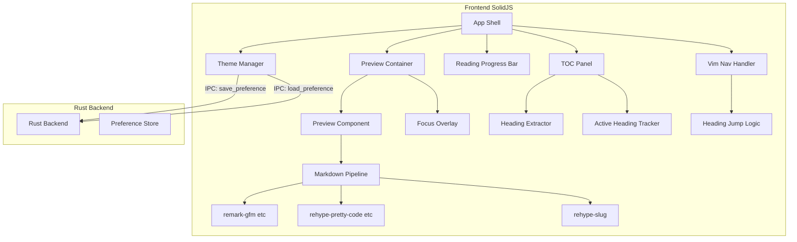
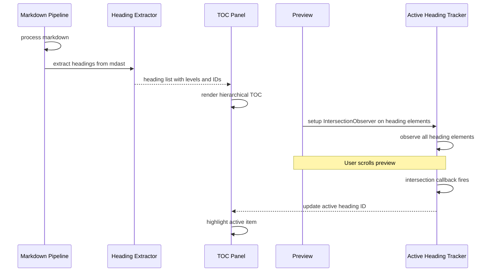
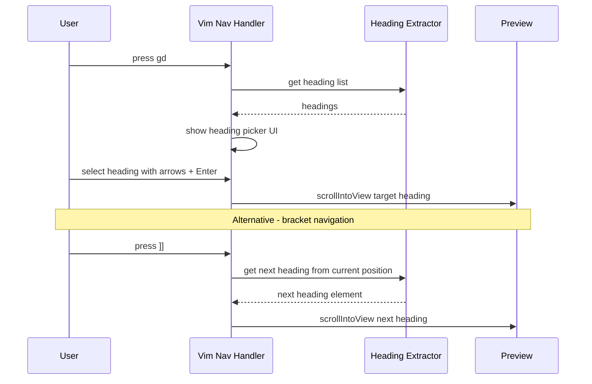
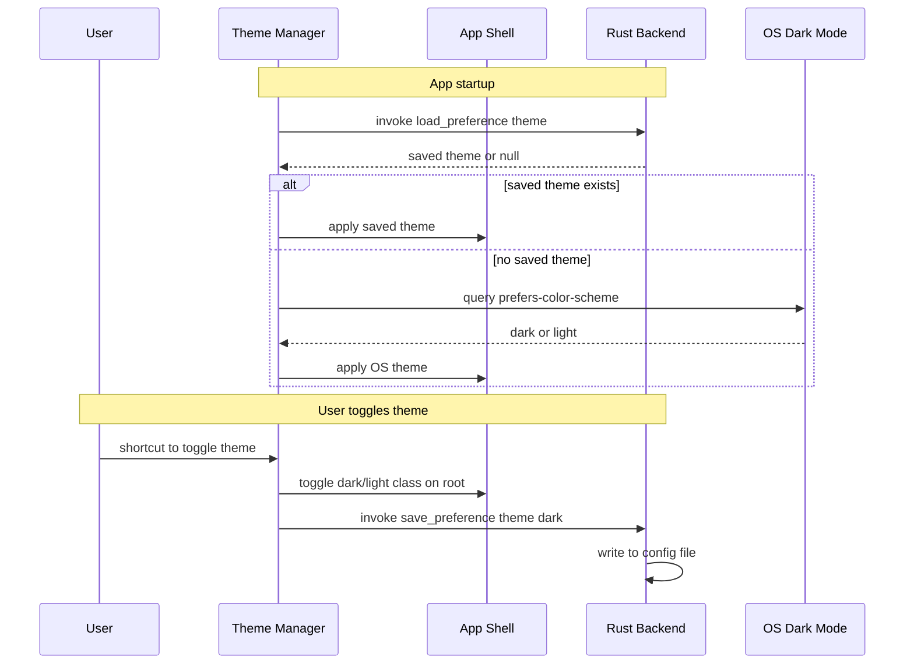
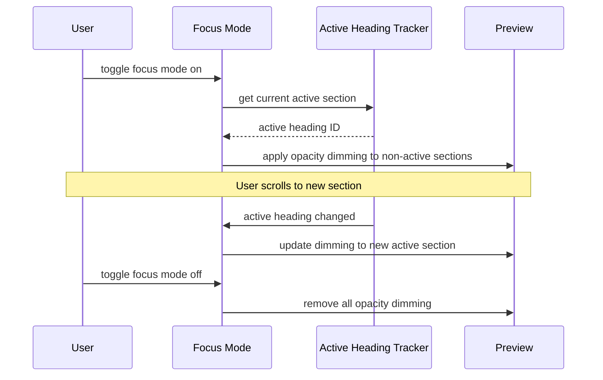

# Design Document: reading-support

## Overview

**Purpose**: Markdownを「読むこと」に最適化された体験を提供する。見出しベースのナビゲーション、美しいGFMレンダリング、カラースキーマ切替、リーディング進捗表示により、長文ドキュメントでも迷子にならず構造を把握しながら効率的に読める環境を構築する。
**Users**: ターミナルAI開発者（Claude Code + Ghostty等）が、CLAUDE.md、spec、PRレビュー等の長いMarkdownドキュメントを閲覧する際に使用する。
**Impact**: `instant-read` で構築した基本プレビュー体験に、ナビゲーション・テーマ・フォーカス機能を追加し、「読む」ワークフローを大幅に強化する。既存のPreview、MarkdownPipeline、Appシェルを拡張する形で実装する。

### Goals
- 見出しベースのTOC表示と現在位置ハイライトで構造把握を支援
- Vim風キーバインドによるキーボードファーストのドキュメントナビゲーション
- GFMの美しいレンダリングとコードブロックのシンタックスハイライト
- ダーク/ライトテーマの切替と永続化
- フォーカスモードとリーディング進捗表示で集中読書を支援

### Non-Goals
- エディタ機能（CodeMirror / vim mode での編集） -- 別spec `inline-edit` で対応
- パイプ入力 / クリップボード / URL入力 -- 別spec `universal-input` で対応
- mermaid / KaTeX レンダリング -- v0.2以降
- 複数ファイルタブ -- v0.2以降
- カスタムテーマの作成UI -- v0.2以降
- 検索（Ctrl+F以外のカスタム検索） -- 別featureで対応
- ブックマーク / 読了位置の永続化 -- v0.2以降

## Architecture

### Existing Architecture Analysis
`instant-read` で以下が構築済み:
- **App**: ルートコンポーネント。`currentFilePath`, `fileContent`, `viewMode` をSignalで管理
- **Preview**: HTML文字列を受け取りレンダリングするコンポーネント。スクロール可能なコンテナ
- **MarkdownPipeline**: unified/remark パイプライン。`process(markdown)` で MD->HTML 変換
- **ThemeProvider**: ダークテーマのCSS適用（Tailwind dark mode）
- **KeyboardHandler**: `Cmd+W`, `:q` のグローバルキーボードショートカット

本featureはこれらを拡張し、新規コンポーネント（TOCPanel, FocusMode, ReadingProgress等）を追加する。

### Architecture Pattern and Boundary Map



**Architecture Integration**:
- **Selected pattern**: Thin Backend + Rich Frontend -- `instant-read` と同一。Rustはテーマ設定の永続化（JSON設定ファイル読み書き）のみ
- **Frontend/Backend boundaries**: Rust = テーマ永続化のファイルI/O / SolidJS = TOC生成、スクロール検知、キーバインド、テーマ切替、フォーカスモード、進捗計算の全て
- **IPC contract**: `save_preference` / `load_preference` コマンドでテーマ設定を永続化
- **Existing patterns preserved**: `instant-read` のApp状態管理パターン、Preview コンポーネント構造を維持

### Technology Stack

| Layer | Choice / Version | Role in Feature | Notes |
|-------|------------------|-----------------|-------|
| Frontend | SolidJS 1.9+ / TypeScript 5.x | TOC、ナビゲーション、テーマ、フォーカスUI、進捗表示 | 細粒度リアクティビティで効率的な部分更新 |
| Markdown | unified 11 / remark-parse 11 / remark-gfm 4 | GFM パース | `instant-read` から継続 |
| HTML Transform | remark-rehype 11 / rehype-stringify 10 | mdast to HTML 変換 | `instant-read` から継続 |
| Heading IDs | rehype-slug 6 | 見出しへの自動ID付与 | TOCリンクとスクロールジャンプに必要 |
| Syntax Highlight | rehype-pretty-code 0.14 / shiki 1.x | コードブロックハイライト | dual theme 対応 |
| Scroll Detection | IntersectionObserver API | 可視見出しの検出 | ブラウザネイティブAPI |
| Styling | Tailwind CSS 3.x | テーマ切替、レイアウト、タイポグラフィ | dark/light class 戦略 |
| Backend | Rust / Tauri v2.10 | テーマ設定の永続化 | 最小限の責務 |
| Build | pnpm / Vite | バンドル、開発サーバー | Tree shaking有効 |

## System Flows

### Flow 1: TOC生成と現在位置追跡



### Flow 2: Vim見出しジャンプ



### Flow 3: カラースキーマ切替と永続化



### Flow 4: フォーカスモード



## Requirements Traceability

| Requirement | Summary | Components | Interfaces | Flows |
|-------------|---------|------------|------------|-------|
| 1.1 | TOC に見出しを階層表示 | HeadingExtractor, TOCPanel | - | Flow 1 |
| 1.2 | TOC のインデント表現 | TOCPanel | - | Flow 1 |
| 1.3 | TOC クリックで見出しスクロール | TOCPanel, Preview | scrollIntoView | Flow 1 |
| 1.4 | TOC 表示/非表示切替 | TOCPanel, KeyboardHandler | - | - |
| 1.5 | 見出しなし時の TOC 非表示 | TOCPanel, HeadingExtractor | - | - |
| 2.1 | 現在見出しのハイライト | ActiveHeadingTracker, TOCPanel | IntersectionObserver | Flow 1 |
| 2.2 | スクロールでハイライト移動 | ActiveHeadingTracker, TOCPanel | IntersectionObserver | Flow 1 |
| 2.3 | TOC パネル内の自動スクロール | TOCPanel | scrollIntoView | Flow 1 |
| 3.1 | gd で見出し選択UI表示 | VimNavHandler, HeadingPicker | - | Flow 2 |
| 3.2 | ]] で次の見出しジャンプ | VimNavHandler | scrollIntoView | Flow 2 |
| 3.3 | [[ で前の見出しジャンプ | VimNavHandler | scrollIntoView | Flow 2 |
| 3.4 | gg でドキュメント先頭ジャンプ | VimNavHandler | scrollTo | Flow 2 |
| 3.5 | G でドキュメント末尾ジャンプ | VimNavHandler | scrollTo | Flow 2 |
| 3.6 | 見出し選択UIのキーボード操作 | HeadingPicker | - | Flow 2 |
| 4.1 | GFM テーブルレンダリング | MarkdownPipeline, Preview CSS | - | - |
| 4.2 | チェックリストレンダリング | MarkdownPipeline, Preview CSS | - | - |
| 4.3 | 脚注レンダリング | MarkdownPipeline, Preview CSS | - | - |
| 4.4 | 取り消し線・自動リンク・絵文字 | MarkdownPipeline | - | - |
| 4.5 | GFM 余白・フォントサイズ | Preview CSS | - | - |
| 4.6 | ネスト構造の正確な表示 | MarkdownPipeline, Preview CSS | - | - |
| 5.1 | トークンレベルのシンタックスハイライト | MarkdownPipeline, Shiki | - | - |
| 5.2 | 主要言語サポート | Shiki language bundles | - | - |
| 5.3 | コードブロック言語ラベル | Preview CSS, rehype-pretty-code | - | - |
| 5.4 | コピーボタン | CodeBlockCopy | Clipboard API | - |
| 5.5 | ダークテーマ用ハイライトカラー | Shiki, ThemeManager | - | - |
| 5.6 | ライトテーマ用ハイライトカラー | Shiki, ThemeManager | - | - |
| 6.1 | ダークテーマデフォルト | ThemeManager | - | Flow 3 |
| 6.2 | テーマ切替ショートカット | ThemeManager, KeyboardHandler | - | Flow 3 |
| 6.3 | テーマの永続化 | ThemeManager, Rust Backend | IPC: save/load_preference | Flow 3 |
| 6.4 | CSS custom properties テーマシステム | ThemeManager, CSS | - | Flow 3 |
| 6.5 | OS ダークモード追従 | ThemeManager | prefers-color-scheme | Flow 3 |
| 7.1 | フォーカスモード有効化 | FocusMode, Preview | - | Flow 4 |
| 7.2 | セクション変更時のフォーカス更新 | FocusMode, ActiveHeadingTracker | - | Flow 4 |
| 7.3 | フォーカスモード無効化 | FocusMode, Preview | - | Flow 4 |
| 7.4 | フォーカスモードのショートカット | FocusMode, KeyboardHandler | - | Flow 4 |
| 8.1 | プログレスバー表示 | ReadingProgress, Preview | scroll event | - |
| 8.2 | リアルタイム更新 | ReadingProgress | scroll event | - |
| 8.3 | パーセンテージ数値表示 | ReadingProgress | - | - |
| 8.4 | テーマに馴染むデザイン | ReadingProgress, ThemeManager | - | - |

## Components and Interfaces

| Component | Domain/Layer | Intent | Req Coverage | Key Dependencies | Contracts |
|-----------|------------|--------|--------------|------------------|-----------|
| HeadingExtractor | Frontend | mdastから見出し情報を抽出 | 1.1, 1.5 | MarkdownPipeline | Service |
| TOCPanel | Frontend | 見出しの階層表示とナビゲーション | 1.1-1.5, 2.1-2.3 | HeadingExtractor, ActiveHeadingTracker | State |
| ActiveHeadingTracker | Frontend | 可視見出しの検出と追跡 | 2.1-2.3 | IntersectionObserver | State |
| VimNavHandler | Frontend | Vim風キーバインドのナビゲーション | 3.1-3.6 | HeadingExtractor, KeyboardHandler | Event |
| HeadingPicker | Frontend | 見出し選択UI | 3.1, 3.6 | HeadingExtractor | State |
| CodeBlockCopy | Frontend | コードブロックのコピー機能 | 5.4 | Clipboard API | Event |
| ThemeManager | Frontend | テーマ切替と永続化 | 6.1-6.5 | Rust Backend IPC | State, IPC Command |
| FocusMode | Frontend | フォーカスモードの制御 | 7.1-7.4 | ActiveHeadingTracker | State |
| ReadingProgress | Frontend | リーディング進捗バー | 8.1-8.4 | Preview scroll | State |
| save_preference | Backend/IPC | 設定の永続化書き込み | 6.3 | Tauri fs | IPC Command |
| load_preference | Backend/IPC | 設定の永続化読み取り | 6.3 | Tauri fs | IPC Command |

### Frontend - SolidJS

#### HeadingExtractor

| Field | Detail |
|-------|--------|
| Intent | MarkdownPipelineのmdast（抽象構文木）から見出し情報を抽出し、構造化データとして提供する |
| Requirements | 1.1, 1.5 |

**Responsibilities & Constraints**
- remarkパイプラインの中間結果（mdast）から heading ノードを走査
- 見出しレベル（h1-h6）、テキスト、IDをリストとして返す
- MarkdownPipelineの `rehype-slug` が生成するIDと一致するIDを算出

**Dependencies**
- Inbound: TOCPanel, VimNavHandler -- 見出しリスト取得 (Critical)
- Outbound: MarkdownPipeline -- mdast の見出しノード取得 (Critical)

**Contracts**: Service

```typescript
interface HeadingInfo {
  id: string;       // rehype-slug と一致するID
  text: string;     // 見出しテキスト
  level: number;    // 1-6
  index: number;    // ドキュメント内の出現順
}

interface HeadingExtractorService {
  /** Markdown文字列から見出し情報を抽出 */
  extract(markdown: string): HeadingInfo[];
}
```

#### TOCPanel

| Field | Detail |
|-------|--------|
| Intent | 見出しを階層構造で表示し、ナビゲーションとアクティブ状態表示を提供する |
| Requirements | 1.1, 1.2, 1.3, 1.4, 1.5, 2.1, 2.2, 2.3 |

**Responsibilities & Constraints**
- 見出しリストを階層的インデントで表示
- クリックで対応する見出しへのスクロール発火
- アクティブ見出しのハイライト表示
- アクティブ項目がパネル外の場合の自動スクロール
- ショートカットによる表示/非表示トグル
- 見出しなし時の自動非表示

**Dependencies**
- Inbound: App -- パネル配置 (Critical)
- Outbound: HeadingExtractor -- 見出しリスト取得 (Critical)
- Outbound: ActiveHeadingTracker -- アクティブ見出しID購読 (Critical)
- Outbound: Preview -- scrollIntoView 呼び出し (Critical)

**Contracts**: State

##### State Management
- `headings: Signal<HeadingInfo[]>` -- 見出しリスト
- `isVisible: Signal<boolean>` -- TOCパネルの表示状態
- `activeHeadingId: Signal<string | null>` -- 現在アクティブな見出しID（ActiveHeadingTrackerから購読）

#### ActiveHeadingTracker

| Field | Detail |
|-------|--------|
| Intent | IntersectionObserverでプレビュー内の可視見出しを検出し、アクティブ見出しIDを管理する |
| Requirements | 2.1, 2.2, 2.3 |

**Responsibilities & Constraints**
- Preview コンテナ内の heading 要素にIntersectionObserverを設定
- 可視範囲に入った見出しのうち最上位のものをアクティブとして報告
- ファイル変更時のObserver再設定

**Dependencies**
- Inbound: TOCPanel, FocusMode -- アクティブ見出しID購読 (Critical)
- Outbound: Preview DOM -- heading 要素の監視 (Critical)

**Contracts**: State

```typescript
interface ActiveHeadingTrackerState {
  /** 現在アクティブな見出しのID */
  activeId: Accessor<string | null>;
  /** Preview要素への参照を設定してObserverを開始 */
  observe(previewContainer: HTMLElement): void;
  /** Observerを停止しクリーンアップ */
  disconnect(): void;
}
```

#### VimNavHandler

| Field | Detail |
|-------|--------|
| Intent | Vim風キーシーケンスを解釈し、見出しジャンプやドキュメントナビゲーションを実行する |
| Requirements | 3.1, 3.2, 3.3, 3.4, 3.5 |

**Responsibilities & Constraints**
- キーシーケンスの状態管理（`g` 入力後に `d` を待つ等）
- `gd`: 見出し選択UIの表示トリガー
- `]]`/`[[`: 次/前の見出しへのスクロール
- `gg`/`G`: ドキュメント先頭/末尾へのスクロール
- 既存のKeyboardHandler（`Cmd+W`, `:q`）との競合回避
- タイムアウト処理（500ms以内にシーケンス完了しない場合リセット）

**Dependencies**
- Inbound: KeyboardHandler -- キーイベント委譲 (Critical)
- Outbound: HeadingExtractor -- 見出しリスト取得 (Critical)
- Outbound: HeadingPicker -- 見出し選択UI表示 (Critical)
- Outbound: Preview -- scrollIntoView / scrollTo (Critical)

**Contracts**: Event

```typescript
interface VimNavConfig {
  /** キーシーケンスのタイムアウト（ms） */
  sequenceTimeout: number;
  /** スクロールの振る舞い */
  scrollBehavior: ScrollBehavior;
}
```

#### HeadingPicker

| Field | Detail |
|-------|--------|
| Intent | 見出し一覧をオーバーレイ表示し、キーボードで選択・確定する |
| Requirements | 3.1, 3.6 |

**Responsibilities & Constraints**
- 見出しリストをフィルタ可能なリストとしてオーバーレイ表示
- 上下キーで選択、Enterで確定、Escでキャンセル
- テキスト入力によるインクリメンタルフィルタ
- 見出しレベルに応じたインデント表示

**Dependencies**
- Inbound: VimNavHandler -- 表示トリガー (Critical)
- Outbound: HeadingExtractor -- 見出しリスト (Critical)
- Outbound: Preview -- scrollIntoView (Critical)

**Contracts**: State

##### State Management
- `isOpen: Signal<boolean>` -- Picker の表示状態
- `selectedIndex: Signal<number>` -- 現在選択中のインデックス
- `filterText: Signal<string>` -- フィルタ文字列

#### CodeBlockCopy

| Field | Detail |
|-------|--------|
| Intent | コードブロックにコピーボタンを追加し、クリップボードコピー機能を提供する |
| Requirements | 5.4 |

**Responsibilities & Constraints**
- Preview レンダリング後、各コードブロック（`pre > code`）にコピーボタンを動的追加
- Clipboard API でコード内容をコピー
- コピー成功時のフィードバック表示（アイコン変化、一時的なトースト等）
- rehype-pretty-code が生成する HTML 構造に合わせたセレクタ

**Dependencies**
- Inbound: Preview -- レンダリング完了イベント (Critical)
- Outbound: Clipboard API -- テキストコピー (Critical)

**Contracts**: Event

#### ThemeManager

| Field | Detail |
|-------|--------|
| Intent | カラースキーマの管理、切替、永続化を担当する |
| Requirements | 6.1, 6.2, 6.3, 6.4, 6.5 |

**Responsibilities & Constraints**
- 起動時: Rust から保存済みテーマを読み込み。未設定なら OS の `prefers-color-scheme` に追従
- テーマ切替: `<html>` 要素の class (`dark`/`light`) を切り替え
- CSS custom properties でテーマ変数を定義（`--color-bg`, `--color-text` 等）
- Shiki の dual theme 対応（`github-dark` / `github-light`）
- 永続化: テーマ変更時に Rust IPC で設定ファイルに保存
- OS 設定変更の `matchMedia` リスナー

**Dependencies**
- Inbound: App -- テーマ状態購読 (Critical)
- Inbound: KeyboardHandler -- テーマ切替イベント (Critical)
- Outbound: Rust IPC -- save_preference / load_preference (Normal)
- Outbound: CSS custom properties -- テーマ変数適用 (Critical)

**Contracts**: State, IPC Command

##### State Management
- `currentTheme: Signal<'dark' | 'light'>` -- 現在のテーマ
- `isUserExplicit: Signal<boolean>` -- ユーザーが明示的に設定したか（OS追従制御用）

#### FocusMode

| Field | Detail |
|-------|--------|
| Intent | 現在のセクション以外を視覚的に薄くし、集中読書を支援する |
| Requirements | 7.1, 7.2, 7.3, 7.4 |

**Responsibilities & Constraints**
- アクティブセクション以外の要素に CSS opacity を適用
- ActiveHeadingTracker のアクティブ見出し変更を購読し、フォーカス対象を更新
- セクション境界の判定: 同レベル以上の次の見出しまでの範囲
- トグル時のスムーズなトランジション

**Dependencies**
- Inbound: KeyboardHandler -- フォーカスモードトグル (Critical)
- Outbound: ActiveHeadingTracker -- アクティブ見出しID購読 (Critical)
- Outbound: Preview DOM -- セクション要素の opacity 操作 (Critical)

**Contracts**: State

##### State Management
- `isEnabled: Signal<boolean>` -- フォーカスモードの有効状態

#### ReadingProgress

| Field | Detail |
|-------|--------|
| Intent | スクロール位置からリーディング進捗を算出し、プログレスバーとして表示する |
| Requirements | 8.1, 8.2, 8.3, 8.4 |

**Responsibilities & Constraints**
- Preview コンテナの `scroll` イベントから進捗パーセンテージを算出
- `(scrollTop / (scrollHeight - clientHeight)) * 100` で計算
- ドキュメント上部に固定表示のプログレスバー
- パーセンテージ数値の表示
- スクロールイベントの throttle 処理（requestAnimationFrame）

**Dependencies**
- Inbound: Preview -- scroll イベント (Critical)
- Outbound: ThemeManager -- テーマ色の適用 (Normal)

**Contracts**: State

##### State Management
- `progress: Signal<number>` -- 0-100 のパーセンテージ

### Backend - Rust

#### save_preference

| Field | Detail |
|-------|--------|
| Intent | キー/値ペアの設定をJSON設定ファイルに書き込む |
| Requirements | 6.3 |

**Responsibilities & Constraints**
- `~/.config/kusa/preferences.json` にJSON形式で設定を保存
- ディレクトリが存在しない場合は自動作成
- 部分更新: 既存設定を読み込み、指定キーのみ更新して書き戻し

**Dependencies**
- Inbound: Frontend ThemeManager -- テーマ設定の永続化要求 (Normal)
- Outbound: OS FileSystem -- 設定ファイル書き込み (Critical)

**Contracts**: IPC Command

##### IPC Command Contract
```typescript
// TypeScript side
invoke('save_preference', { key: string, value: string }): Promise<void>
```
```rust
// Rust side
#[tauri::command]
fn save_preference(
    app: tauri::AppHandle,
    key: String,
    value: String,
) -> Result<(), String> { }
```

#### load_preference

| Field | Detail |
|-------|--------|
| Intent | キーを指定して設定ファイルから値を読み取る |
| Requirements | 6.3 |

**Responsibilities & Constraints**
- `~/.config/kusa/preferences.json` から指定キーの値を読み取り
- 設定ファイルが存在しない場合は `null` を返す
- キーが存在しない場合も `null` を返す

**Dependencies**
- Inbound: Frontend ThemeManager -- テーマ設定の読み込み要求 (Normal)
- Outbound: OS FileSystem -- 設定ファイル読み取り (Critical)

**Contracts**: IPC Command

##### IPC Command Contract
```typescript
// TypeScript side
invoke<string | null>('load_preference', { key: string }): Promise<string | null>
```
```rust
// Rust side
#[tauri::command]
fn load_preference(
    app: tauri::AppHandle,
    key: String,
) -> Result<Option<String>, String> { }
```

### MarkdownPipeline 拡張

| Field | Detail |
|-------|--------|
| Intent | 既存パイプラインに rehype-slug を追加し、見出しIDの自動生成とdual theme対応を行う |
| Requirements | 1.1, 4.1-4.6, 5.1-5.6 |

**Responsibilities & Constraints**
- rehype-slug プラグインの追加（見出しにID属性を自動付与）
- rehype-pretty-code の dual theme 設定（`github-dark` + `github-light`）
- 見出し抽出用の mdast アクセスポイントの提供
- GFM レンダリング品質の向上（テーブル、脚注、チェックリスト等のCSS整備）

**Dependencies**
- Inbound: HeadingExtractor -- mdast からの見出し抽出 (Critical)
- Outbound: rehype-slug, rehype-pretty-code -- プラグイン (Critical)

**拡張 Service Contract**
```typescript
interface MarkdownPipelineService {
  /** Markdown文字列をHTML文字列に変換（既存） */
  process(markdown: string): Promise<string>;

  /** 大ファイル用チャンク処理（既存） */
  processChunked(markdown: string, onChunk: (html: string) => void): Promise<void>;

  /** 見出し情報を抽出（新規） */
  extractHeadings(markdown: string): HeadingInfo[];
}
```

## Error Handling

### Error Strategy
- フロントエンド中心の機能のため、大半のエラーはUI内でハンドル
- テーマ永続化の IPC エラーは非致命的: 失敗してもテーマ切替自体は動作し、次回起動時にデフォルトに戻る
- IntersectionObserver の非対応は考慮不要（WebView は Chromium ベースで必ずサポート）

### Error Categories

| Category | Trigger | Response | Req |
|----------|---------|----------|-----|
| User Error | コピーボタンクリック時のClipboard API不可 | フォールバックコピー方法を試行、失敗時はエラートースト | 5.4 |
| System Error | テーマ設定の保存失敗 | コンソールログ、テーマ切替は動作、次回はデフォルト | 6.3 |
| System Error | テーマ設定の読み込み失敗 | ダークテーマにフォールバック | 6.3 |
| System Error | IntersectionObserver コールバックエラー | TOCハイライト停止、手動ナビゲーションは継続 | 2.1, 2.2 |
| Rendering Error | 不正なMarkdown構文 | 可能な範囲でレンダリング、壊れた部分はプレーンテキスト表示 | 4.1-4.6 |

## Testing Strategy

### Unit Tests
- **HeadingExtractor**: 各レベルの見出し抽出、空文書、見出しなし文書、特殊文字を含む見出し
- **ReadingProgress**: パーセンテージ算出ロジック（先頭=0%、末尾=100%、中間値）
- **VimNavHandler**: キーシーケンス解釈（`gd`, `]]`, `[[`, `gg`, `G`）、タイムアウト、無効なシーケンス
- **ThemeManager**: テーマ切替ロジック、OS追従、ユーザー明示設定の優先

### Integration Tests
- **IPC round-trip**: `save_preference` / `load_preference` の正常系・異常系
- **MarkdownPipeline + HeadingExtractor**: 見出しIDの一致検証（rehype-slug が生成するIDとextract結果）
- **ActiveHeadingTracker + TOCPanel**: スクロールによるハイライト更新

### E2E Tests
- **TOCナビゲーション**: ファイル表示 -> TOCクリック -> 対応見出しへのスクロール
- **キーボードナビゲーション**: `]]`/`[[` で見出し間移動 -> 正しい見出しに到達
- **テーマ切替**: ショートカット -> テーマ変更 -> アプリ再起動 -> テーマ永続化確認
- **フォーカスモード**: 有効化 -> 非アクティブセクションの薄表示確認 -> 無効化 -> 復元確認

## Security Considerations

- **Clipboard API**: `navigator.clipboard.writeText` 使用。HTTPS/Secure Context 必須だがTauri WebView内は常にSecure
- **設定ファイル**: `~/.config/kusa/` に限定。パストラバーサル防止のためキー名のバリデーション
- **Tauri allowlist**: 設定ファイル読み書きのスコープを `~/.config/kusa/` に制限
- **HTML サニタイズ**: `instant-read` の rehype-sanitize が引き続き有効。コピーボタン追加はサニタイズ後のDOM操作

## Performance and Scalability

- **IntersectionObserver**: ネイティブAPIで高効率。スクロールイベントの直接監視より大幅に軽量
- **スクロールイベント throttle**: ReadingProgress の scroll リスナーを `requestAnimationFrame` で間引き、60fps を超える発火を防止
- **TOC 再生成**: ファイル変更時のみ。スクロールでは見出しリストを再計算しない
- **フォーカスモード**: CSS opacity のみ使用。DOM 操作（要素の追加/削除）を行わないため高速
- **テーマ切替**: CSS class の切替のみ。Shiki の dual theme で再レンダリング不要
- **大ファイル（見出し多数）**: 100見出し程度まではリスト表示で十分。それ以上は仮想スクロールを検討（v0.2以降）
- **rehype-slug**: 既存パイプラインへのプラグイン追加。追加オーバーヘッドは無視できる程度
