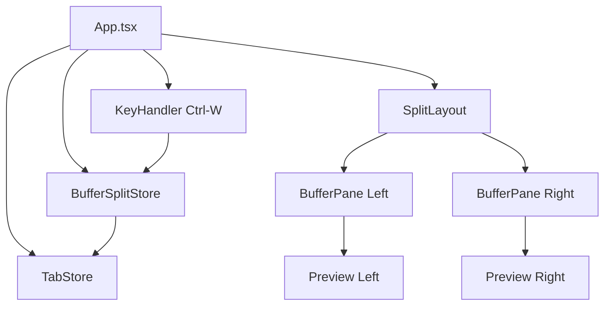
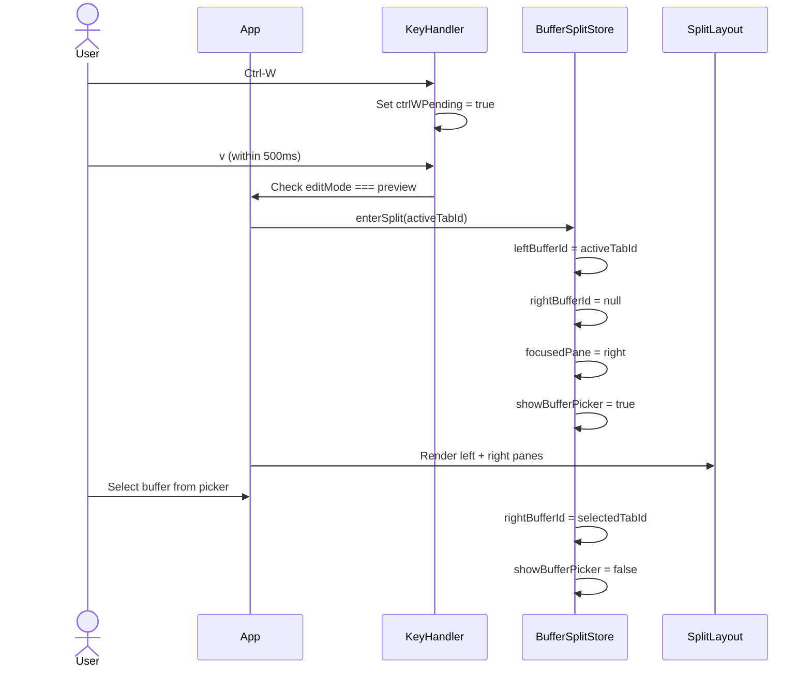
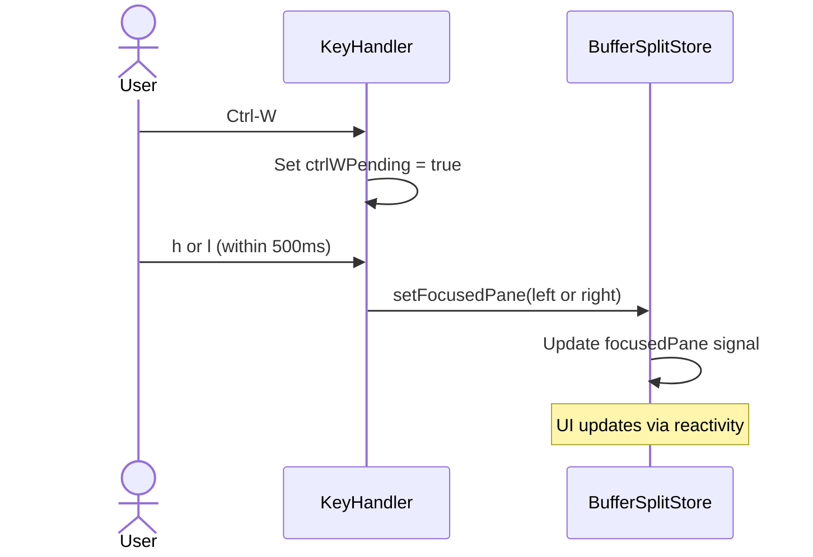

# Design Document: split-buffer-view

## Overview
**Purpose**: nvimライクなウィンドウ分割機能を提供し、2つの異なるMarkdownバッファを左右に並べてプレビュー表示する。
**Users**: ターミナルAI開発者が、仕様書の比較・参照・レビュー時に使用する。
**Impact**: 既存の editMode / tabStore には変更を加えず、独立したバッファ分割ストアを新設してアドオンとして機能を追加する。

### Goals
- nvim の `:vsplit` に相当する左右バッファ分割をプレビューモードで実現
- `Ctrl-W v/h/l/q` の 2ストロークキーバインドで操作
- 既存の Split mode（エディタ+プレビュー）と排他的に共存

### Non-Goals
- 上下分割（`:split`）は対象外
- 3ペイン以上の分割は対象外
- バッファ分割中のエディタ操作（プレビュー専用）
- タブの複数行表示やタブグループ

## Architecture

### Architecture Pattern & Boundary Map



**Architecture Integration**:
- Selected pattern: 独立ストア + 既存コンポーネント再利用
- Frontend/Backend boundaries: 全てフロントエンドで完結（Rust側の変更なし）
- IPC contract: 変更なし
- Existing patterns preserved: tabStore, SplitLayout, Preview, editMode

### Technology Stack

| Layer | Choice / Version | Role in Feature | Notes |
|-------|------------------|-----------------|-------|
| Frontend | SolidJS + TypeScript | 状態管理・UI・キーハンドリング | 全ロジックはフロントエンド |
| Styling | Tailwind CSS | ペインヘッダー・フォーカスインジケーター | 既存パターン踏襲 |

## System Flows

### バッファ分割の開始フロー



### ペイン間フォーカス移動フロー



## Requirements Traceability

| Requirement | Summary | Components | Interfaces | Flows |
|-------------|---------|------------|------------|-------|
| 1.1 | Ctrl-W v で分割開始 | KeyHandler, BufferSplitStore | enterSplit() | 分割開始フロー |
| 1.2 | ドラッグリサイズ | SplitLayout | leftRatio signal | - |
| 1.3 | 独立スクロール | BufferPane | 各ペイン独立 div | - |
| 1.4 | Ctrl-W q で分割終了 | KeyHandler, BufferSplitStore | exitSplit() | - |
| 2.1 | Ctrl-W h で左移動 | KeyHandler, BufferSplitStore | setFocusedPane() | フォーカス移動フロー |
| 2.2 | Ctrl-W l で右移動 | KeyHandler, BufferSplitStore | setFocusedPane() | フォーカス移動フロー |
| 2.3 | フォーカスインジケーター | BufferPane | focusedPane signal | - |
| 2.4 | クリックでフォーカス | BufferPane | onClick handler | - |
| 3.1 | バッファ選択ピッカー | BufferPicker | showBufferPicker signal | 分割開始フロー |
| 3.2 | Shift+H/L でバッファ切替 | KeyHandler, BufferSplitStore | switchPaneBuffer() | - |
| 3.3 | ペインヘッダーにファイル名 | BufferPane | fileName display | - |
| 3.4 | タブバーのハイライト | TabBar | focusedPaneTabId | - |
| 4.1 | 分割中 Ctrl+E 無効 | App KeyHandler | guard condition | - |
| 4.2 | 分割終了で preview 復帰 | BufferSplitStore | exitSplit() | - |
| 4.3 | edit/split 中 Ctrl-W v 無効 | App KeyHandler | guard condition | - |
| 5.1 | 最小幅 200px | SplitLayout | MIN_PX constant | - |
| 5.2 | 50:50 初期分割 | SplitLayout | leftRatio default | - |
| 5.3 | ディバイダー表示 | SplitLayout | divider element | - |
| 5.4 | フルレンダリング | Preview | processMarkdown() | - |

## Components and Interfaces

| Component | Domain/Layer | Intent | Req Coverage | Key Dependencies | Contracts |
|-----------|--------------|--------|--------------|------------------|-----------|
| BufferSplitStore | State | ペイン分割状態の管理 | 1.1-1.4, 2.1-2.4, 3.1-3.2, 4.1-4.2 | TabStore | State |
| BufferPane | UI | 各ペインのコンテナ（ヘッダー + プレビュー） | 2.3-2.4, 3.3, 5.4 | Preview, BufferSplitStore | - |
| BufferPicker | UI | バッファ選択ポップアップ | 3.1 | TabStore | - |
| KeyHandler (拡張) | Logic | Ctrl-W 2ストロークキー処理 | 1.1, 1.4, 2.1-2.2, 3.2, 4.1, 4.3 | BufferSplitStore | Event |

### State Layer

#### BufferSplitStore

| Field | Detail |
|-------|--------|
| Intent | バッファ分割の全状態を管理する独立ストア |
| Requirements | 1.1-1.4, 2.1-2.4, 3.1-3.2, 4.1-4.2 |

**Responsibilities & Constraints**
- ペイン分割の active/inactive 状態管理
- 各ペインに割り当てられたバッファ（タブID）の追跡
- フォーカスされたペインの管理
- バッファピッカーの表示状態管理
- tabStore は参照のみ（変更しない）

**Dependencies**
- Inbound: App.tsx — 状態参照と操作呼び出し (Critical)
- Outbound: TabStore — バッファ（タブ）リストの参照 (Critical)

**Contracts**: State

##### State Management

```typescript
interface BufferSplitState {
  /** 分割が有効かどうか */
  active: boolean;
  /** 左ペインに表示中のタブID */
  leftTabId: string | null;
  /** 右ペインに表示中のタブID */
  rightTabId: string | null;
  /** フォーカスされたペイン */
  focusedPane: "left" | "right";
  /** バッファピッカー表示中 */
  showBufferPicker: boolean;
}

interface BufferSplitStore {
  /** リアクティブ状態 */
  state: Accessor<BufferSplitState>;
  /** 分割を開始（現在のタブIDを左ペインに設定） */
  enterSplit(currentTabId: string): void;
  /** 分割を終了 */
  exitSplit(): void;
  /** フォーカスペインを設定 */
  setFocusedPane(pane: "left" | "right"): void;
  /** フォーカスされたペインのバッファを切り替え */
  switchPaneBuffer(tabId: string): void;
  /** フォーカスペインのバッファを次/前に切替 */
  cyclePaneBuffer(direction: "next" | "prev", tabs: Tab[]): void;
  /** バッファピッカーを閉じる */
  closeBufferPicker(): void;
  /** フォーカスペインのタブIDを返す */
  focusedTabId: Accessor<string | null>;
}
```

- Signal model: 単一の `createSignal<BufferSplitState>` で管理。SolidJS の fine-grained reactivity により、個別プロパティの変更でも最小限の再レンダリング
- Persistence: 不要（セッション内のみ）
- Cleanup: `exitSplit()` で全状態リセット

### UI Layer

#### BufferPane

| Field | Detail |
|-------|--------|
| Intent | ペインのコンテナ。ヘッダー（ファイル名）+ Preview を表示 |
| Requirements | 2.3, 2.4, 3.3, 5.4 |

**Responsibilities & Constraints**
- ペインヘッダーにファイル名を表示
- フォーカスインジケーター（上部ボーダー）の表示
- クリックでフォーカス取得
- 独立したスクロール位置の保持
- Preview コンポーネントへの HTML 受け渡し

```typescript
interface BufferPaneProps {
  tabId: string | null;
  tabs: Tab[];
  html: string;
  isFocused: boolean;
  onFocus: () => void;
}
```

#### BufferPicker

| Field | Detail |
|-------|--------|
| Intent | バッファ選択用のミニリスト表示 |
| Requirements | 3.1 |

**Responsibilities & Constraints**
- 現在開いているタブ一覧を表示
- キーボード（j/k で移動、Enter で選択、Esc でキャンセル）操作
- 選択後に `switchPaneBuffer()` を呼び出し

```typescript
interface BufferPickerProps {
  tabs: Tab[];
  onSelect: (tabId: string) => void;
  onCancel: () => void;
}
```

### Logic Layer

#### KeyHandler 拡張（Ctrl-W 2ストローク）

| Field | Detail |
|-------|--------|
| Intent | Ctrl-W プレフィックスの 2ストロークキーバインド処理 |
| Requirements | 1.1, 1.4, 2.1, 2.2, 3.2, 4.1, 4.3 |

**実装方式**:
- `ctrlWPending` signal で待機状態を管理
- Ctrl-W 押下 → `ctrlWPending = true` + 500ms タイマー開始
- タイマー内に次キー押下 → 操作実行 + `ctrlWPending = false`
- タイマー超過 → `ctrlWPending = false`（何もしない）

**キーマッピング**:

| Sequence | Action | Guard |
|----------|--------|-------|
| Ctrl-W → v | `enterSplit()` | editMode === "preview" かつ !bufferSplit.active |
| Ctrl-W → q | `exitSplit()` | bufferSplit.active |
| Ctrl-W → h | `setFocusedPane("left")` | bufferSplit.active |
| Ctrl-W → l | `setFocusedPane("right")` | bufferSplit.active |
| Shift+H | `cyclePaneBuffer("prev")` | bufferSplit.active |
| Shift+L | `cyclePaneBuffer("next")` | bufferSplit.active |

## Error Handling

### Error Strategy
バッファ分割はプレビュー専用の読み取り操作であり、致命的エラーの発生は限定的。

### Error Categories
- **User Errors**: タブが1つもない状態で分割しようとする → 分割操作を無視（何もしない）
- **State Errors**: ペインに割り当てられたタブが閉じられた → そのペインを単一ペインに戻し分割を終了

## Testing Strategy

### Unit Tests
- `BufferSplitStore`: enterSplit/exitSplit/setFocusedPane/cyclePaneBuffer の各操作
- 排他制御: editMode !== "preview" 時の enterSplit ガード
- タブ削除時のクリーンアップ

### Integration Tests
- Ctrl-W 2ストロークキーバインドの動作
- SplitLayout + BufferPane の連携
- TabBar のハイライト同期
