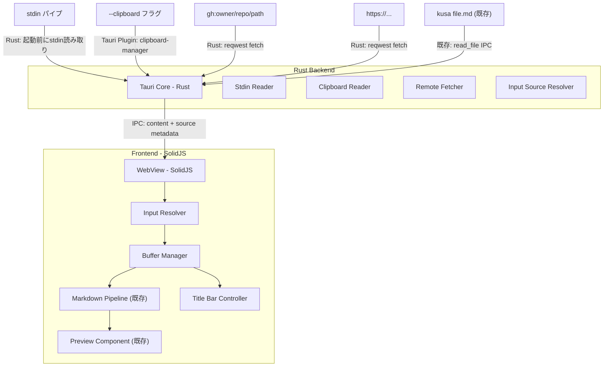
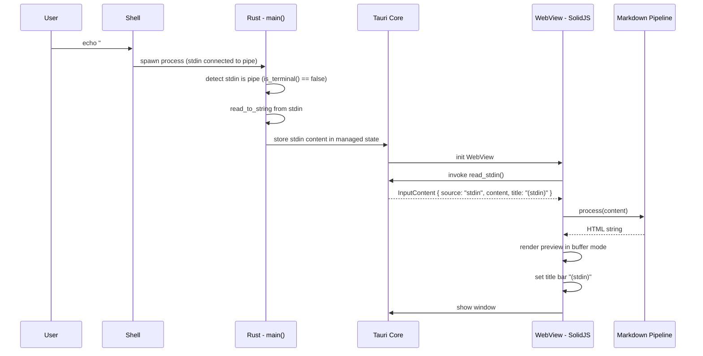
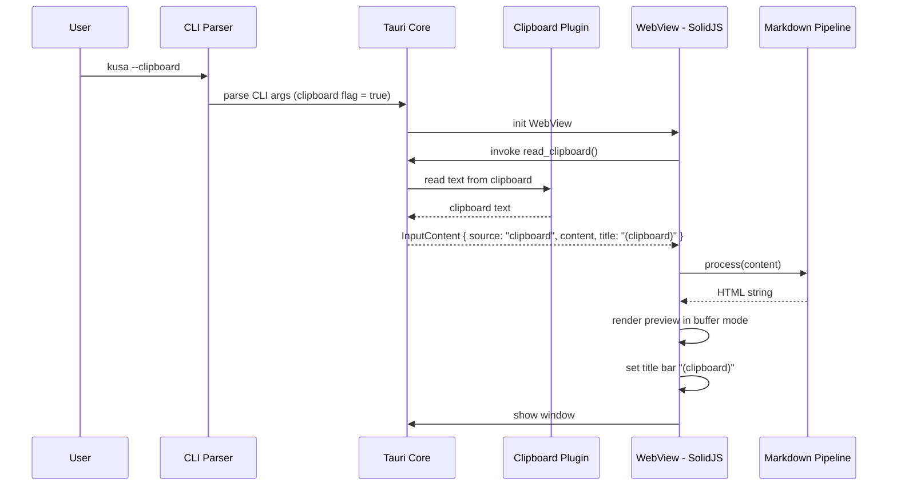
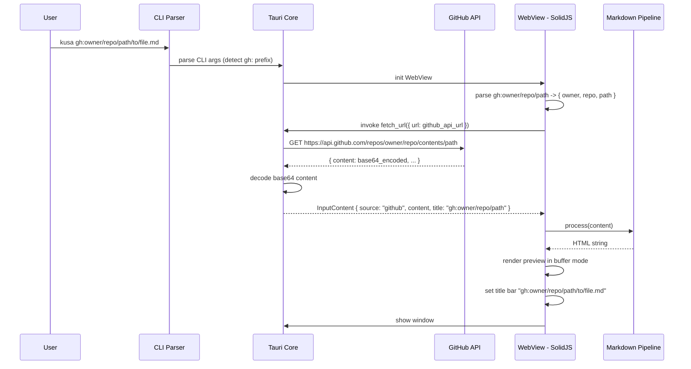
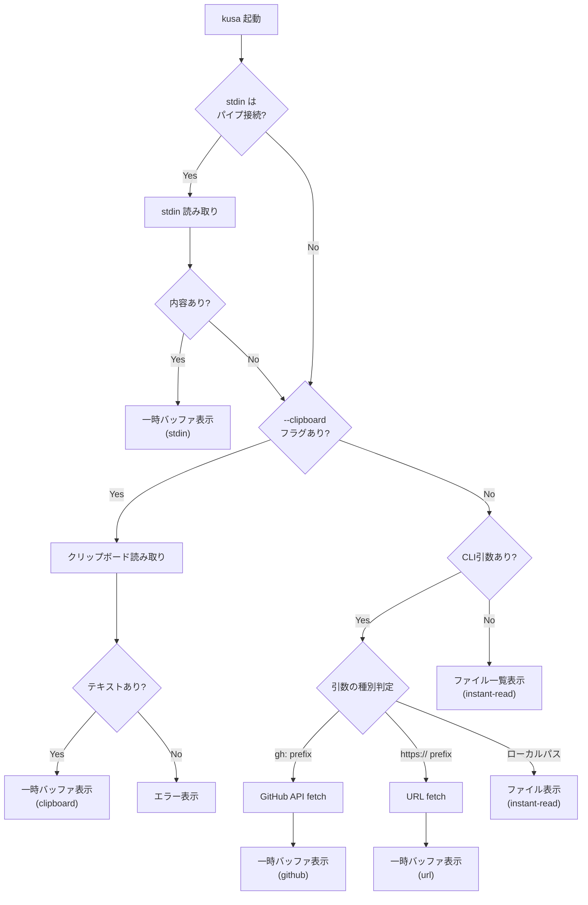

# Design Document: universal-input

## Overview

**Purpose**: ターミナルAI開発者が、ローカルファイルに限らずあらゆるソースのMarkdownを即座にプレビュー表示する体験を提供する。パイプ入力、クリップボード、GitHub shorthand、任意のURLからMarkdownコンテンツを取得し、一時バッファとして美しく表示する。
**Users**: Claude Code + Ghostty 等でターミナル完結の開発を行うユーザーが、ファイルとして手元に存在しないMarkdown（コマンド出力、クリップボード内容、GitHub上のドキュメント）を確認する際に使用する。
**Impact**: instant-read（ローカルファイルのみ）の入力ソースを拡張し、kusa を「あらゆるMarkdownの統一ビューワー」に進化させる。

### Goals
- stdin パイプ入力で任意のコマンド出力をプレビュー表示
- `--clipboard` / `-c` フラグでクリップボード内容を即座に表示
- `gh:owner/repo/path` shorthand で GitHub 上のファイルを直接取得・表示
- 任意の URL から Markdown ファイルを fetch して表示
- 一時バッファモードによる読み取り専用表示（ファイル保存なし）
- タイトルバーにソース情報を表示し入力元を明確化

### Non-Goals
- 取得した一時バッファの内容をローカルファイルに保存する機能 -- 別spec `buffer-export` で対応
- GitHub 認証トークンによるプライベートリポジトリへのアクセス -- v0.2以降
- 一時バッファの編集機能 -- 別spec `inline-edit` で対応
- WebSocket/SSE によるリアルタイムストリーミング表示 -- 別spec
- GitHub PR diff やコメントの表示 -- 別spec `gh-integration` で対応

## Architecture

### Architecture Pattern & Boundary Map



**Architecture Integration**:
- **Selected pattern**: Thin Backend + Rich Frontend -- Rust は I/O バウンドな取得処理（stdin 読み取り、クリップボード取得、HTTP fetch）のみ担当。パース・表示ロジックは全て SolidJS
- **Frontend/Backend boundaries**: Rust = stdin 読み取り・クリップボード取得・HTTP fetch・入力ソース解決 / SolidJS = 入力コンテンツの管理・MD パース・レンダリング・タイトルバー制御
- **IPC contract**: `read_stdin` でstdin内容、`read_clipboard` でクリップボード内容、`fetch_url` でURL/GitHub content を取得。全て `InputContent` 統一型で返却
- **Existing patterns preserved**: CLAUDE.md の「Rust 側は最小限」方針に準拠。instant-read の Preview、MarkdownPipeline、App シェルを再利用
- **instant-read との関係**: App コンポーネントの `viewMode` に `'buffer'` を追加。ファイル表示と一時バッファ表示を `InputContent` 型で統一管理

### Technology Stack

| Layer | Choice / Version | Role in Feature | Notes |
|-------|------------------|-----------------|-------|
| Frontend | SolidJS 1.9+ / TypeScript 5.x | UI 状態管理、バッファ管理、タイトルバー制御 | instant-read と共有 |
| Markdown | unified 11 / remark-parse 11 / remark-gfm 4 | GFM パース | instant-read のパイプライン再利用 |
| Styling | Tailwind CSS 3.x | 一時バッファ表示の UI | ダークテーマデフォルト |
| Backend | Rust / Tauri v2.10 | stdin 読み取り、クリップボード取得、HTTP fetch | 最小限の責務 |
| HTTP Client | reqwest 0.12 | GitHub API / URL fetch | Rust 側で CORS 制限回避 |
| Clipboard | tauri-plugin-clipboard-manager 2.x | システムクリップボード読み取り | Tauri 公式プラグイン |
| CLI | tauri-plugin-cli 2.x | `--clipboard` / `-c` フラグ追加 | instant-read で導入済み |
| Build | pnpm / Vite | バンドル、開発サーバー | instant-read と共有 |

## System Flows

### Flow 1: stdin パイプ入力 -> プレビュー表示



### Flow 2: クリップボード読み取り -> プレビュー表示



### Flow 3: GitHub shorthand -> プレビュー表示



### Flow 4: 入力ソース解決フロー



## Requirements Traceability

| Requirement | Summary | Components | Interfaces | Flows |
|-------------|---------|------------|------------|-------|
| 1.1 | echo パイプ入力 | StdinReader, BufferManager, Preview | IPC: read_stdin | Flow 1 |
| 1.2 | cat パイプ入力 | StdinReader, BufferManager, Preview | IPC: read_stdin | Flow 1 |
| 1.3 | gh CLI パイプ入力 | StdinReader, BufferManager, Preview | IPC: read_stdin | Flow 1 |
| 1.4 | stdin 一時バッファ保持 | BufferManager | - | Flow 1 |
| 1.5 | タイトルバー (stdin) | TitleBarController | Tauri Window API | Flow 1 |
| 1.6 | 空stdin フォールバック | InputSourceResolver, App | - | Flow 4 |
| 2.1 | --clipboard フラグ | ClipboardReader, BufferManager | IPC: read_clipboard | Flow 2 |
| 2.2 | -c 短縮フラグ | CLI Plugin config | - | Flow 2 |
| 2.3 | タイトルバー (clipboard) | TitleBarController | Tauri Window API | Flow 2 |
| 2.4 | クリップボード空エラー | ErrorDisplay | IPC: read_clipboard Error | Flow 2 |
| 2.5 | clipboard 一時バッファ保持 | BufferManager | - | Flow 2 |
| 3.1 | gh:shorthand 取得 | RemoteFetcher, BufferManager | IPC: fetch_url | Flow 3 |
| 3.2 | gh:owner/repo → README | InputResolver (parse) | IPC: fetch_url | Flow 3 |
| 3.3 | GitHub URL 取得 | InputResolver (parse), RemoteFetcher | IPC: fetch_url | Flow 3 |
| 3.4 | タイトルバー (github) | TitleBarController | Tauri Window API | Flow 3 |
| 3.5 | ネットワーク/404 エラー | ErrorDisplay | IPC: fetch_url Error | - |
| 3.6 | レート制限エラー | ErrorDisplay | IPC: fetch_url Error | - |
| 3.7 | GitHub 一時バッファ保持 | BufferManager | - | Flow 3 |
| 4.1 | raw URL 取得 | RemoteFetcher, BufferManager | IPC: fetch_url | - |
| 4.2 | 任意 URL 取得 | RemoteFetcher, BufferManager | IPC: fetch_url | - |
| 4.3 | タイトルバー (url) | TitleBarController | Tauri Window API | - |
| 4.4 | HTTP エラー表示 | ErrorDisplay | IPC: fetch_url Error | - |
| 4.5 | URL 一時バッファ保持 | BufferManager | - | - |
| 5.1 | 一時バッファモード表示 | BufferManager, App | - | - |
| 5.2 | 編集モード無効化 | BufferManager, App | - | - |
| 5.3 | メモリ上のみ保持 | BufferManager | - | - |
| 5.4 | ウィンドウ閉じでバッファ破棄 | BufferManager, App | - | - |
| 5.5 | ソース種別タイトルバー表示 | TitleBarController | Tauri Window API | - |
| 6.1 | 入力ソース優先順位 | InputSourceResolver | - | Flow 4 |
| 6.2 | stdin 優先 | InputSourceResolver | - | Flow 4 |
| 6.3 | 排他制御 | InputSourceResolver | - | Flow 4 |

## Components and Interfaces

| Component | Domain/Layer | Intent | Req Coverage | Key Dependencies | Contracts |
|-----------|------------|--------|--------------|------------------|-----------|
| InputSourceResolver | Frontend | 入力ソースの判定と優先順位解決 | 6.1-6.3 | App, CLI args | Logic |
| BufferManager | Frontend | 一時バッファの状態管理 | 1.4, 2.5, 3.7, 4.5, 5.1-5.4 | SolidJS Signal | State |
| TitleBarController | Frontend | ソース情報に基づくタイトルバー更新 | 1.5, 2.3, 3.4, 4.3, 5.5 | Tauri Window API | Service |
| GitHubShorthandParser | Frontend | gh: shorthand と GitHub URL のパース | 3.1-3.3 | - | Pure Function |
| read_stdin | Backend/IPC | stdin パイプ内容の読み取り | 1.1-1.3, 1.6 | std::io::stdin | IPC Command |
| read_clipboard | Backend/IPC | クリップボード内容の読み取り | 2.1, 2.4 | tauri-plugin-clipboard-manager | IPC Command |
| fetch_url | Backend/IPC | URL/GitHub API からのコンテンツ取得 | 3.1-3.6, 4.1-4.4 | reqwest | IPC Command |
| App (拡張) | Frontend | viewMode に 'buffer' を追加 | 5.1, 5.2 | instant-read App | State |
| ErrorDisplay (既存) | Frontend | 各種エラーメッセージ表示 | 2.4, 3.5, 3.6, 4.4 | instant-read ErrorDisplay | - |
| Preview (既存) | Frontend | バッファ内容のプレビュー表示 | All | instant-read Preview | - |

### Shared Types

#### InputContent (IPC 共通型)

全ての入力ソースからの取得結果を統一する型。

```typescript
// TypeScript side
type InputSource = 'file' | 'stdin' | 'clipboard' | 'github' | 'url';

interface InputContent {
  /** 入力ソースの種別 */
  source: InputSource;
  /** Markdown コンテンツ本体 */
  content: string;
  /** タイトルバーに表示するラベル */
  title: string;
  /** ファイルソースの場合のパス（一時バッファの場合は null） */
  filePath: string | null;
}
```

```rust
// Rust side
#[derive(serde::Serialize, Clone)]
#[serde(rename_all = "camelCase")]
pub struct InputContent {
    pub source: String,       // "file" | "stdin" | "clipboard" | "github" | "url"
    pub content: String,
    pub title: String,
    pub file_path: Option<String>,
}
```

### Backend - Rust

#### read_stdin

| Field | Detail |
|-------|--------|
| Intent | 起動時にstdinがパイプ接続されていた場合の内容を返す |
| Requirements | 1.1, 1.2, 1.3, 1.6 |

**Responsibilities & Constraints**
- Tauri 起動前に `std::io::stdin().is_terminal()` で判定（`is-terminal` crate）
- パイプ接続時に `read_to_string` で全内容を読み取り
- 読み取った内容を `tauri::State<StdinContent>` として managed state に保持
- IPC コマンドで managed state から内容を返す
- 空内容の場合は `None` を返しフロントエンドにフォールバック判断を委ねる

**Dependencies**
- Inbound: Frontend App -- stdin 内容の取得要求 (Critical)
- Outbound: std::io::stdin -- プロセス標準入力 (Critical)

**Contracts**: IPC Command

##### IPC Command Contract
```typescript
// TypeScript side
invoke<InputContent | null>('read_stdin'): Promise<InputContent | null>
```
```rust
// Rust side
#[tauri::command]
fn read_stdin(state: tauri::State<'_, StdinState>) -> Option<InputContent> {
    state.content.clone()
}

struct StdinState {
    content: Option<InputContent>,
}
```

##### Stdin 読み取りタイミング

```rust
// main.rs - Tauri builder 前に実行
fn read_stdin_if_piped() -> Option<InputContent> {
    use std::io::{self, Read};

    if io::stdin().is_terminal() {
        return None; // TTY の場合はスキップ
    }

    let mut buffer = String::new();
    match io::stdin().read_to_string(&mut buffer) {
        Ok(_) if !buffer.trim().is_empty() => Some(InputContent {
            source: "stdin".to_string(),
            content: buffer,
            title: "(stdin)".to_string(),
            file_path: None,
        }),
        _ => None,
    }
}
```

#### read_clipboard

| Field | Detail |
|-------|--------|
| Intent | システムクリップボードのテキスト内容を取得する |
| Requirements | 2.1, 2.4 |

**Responsibilities & Constraints**
- `tauri-plugin-clipboard-manager` のAPIでクリップボードテキストを読み取り
- テキストが存在しない場合は構造化エラーを返す
- 画像やバイナリデータは対象外（テキストのみ）

**Dependencies**
- Inbound: Frontend App -- クリップボード内容の取得要求 (Critical)
- Outbound: tauri-plugin-clipboard-manager -- OS クリップボード (Critical)

**Contracts**: IPC Command

##### IPC Command Contract
```typescript
// TypeScript side
invoke<InputContent>('read_clipboard'): Promise<InputContent>
// Error: "クリップボードにテキストが見つかりません"
```
```rust
// Rust side
#[tauri::command]
async fn read_clipboard(
    clipboard: tauri::State<'_, tauri_plugin_clipboard_manager::ClipboardManager>,
) -> Result<InputContent, String> {
    match clipboard.read_text() {
        Ok(text) if !text.trim().is_empty() => Ok(InputContent {
            source: "clipboard".to_string(),
            content: text,
            title: "(clipboard)".to_string(),
            file_path: None,
        }),
        Ok(_) => Err("クリップボードにテキストが見つかりません".to_string()),
        Err(e) => Err(format!("クリップボードの読み取りに失敗しました: {}", e)),
    }
}
```

#### fetch_url

| Field | Detail |
|-------|--------|
| Intent | 指定URLまたはGitHub APIからMarkdownコンテンツを取得する |
| Requirements | 3.1-3.6, 4.1-4.4 |

**Responsibilities & Constraints**
- `reqwest` による HTTP GET リクエスト（Rust 側で CORS 制限を回避）
- GitHub API レスポンスの base64 デコード対応
- タイムアウト設定（10秒）
- HTTP エラー、ネットワークエラー、レート制限の構造化エラーレスポンス
- User-Agent ヘッダー設定（GitHub API 要件）

**Dependencies**
- Inbound: Frontend App -- リモートコンテンツの取得要求 (Critical)
- Outbound: reqwest -- HTTP クライアント (Critical)
- Outbound: GitHub API / 外部URL -- リモートサーバー (External)

**Contracts**: IPC Command

##### IPC Command Contract
```typescript
// TypeScript side
interface FetchUrlParams {
  url: string;
  isGitHubApi: boolean;
}

invoke<InputContent>('fetch_url', { url: string, isGitHubApi: boolean, title: string }): Promise<InputContent>
// Errors:
// - "ネットワーク接続エラー: {detail}"
// - "HTTP エラー 404: リポジトリまたはファイルが見つかりません"
// - "GitHub API レート制限に到達しました。約 {minutes} 分後にリトライしてください"
```
```rust
// Rust side
#[tauri::command]
async fn fetch_url(
    url: String,
    is_github_api: bool,
    title: String,
) -> Result<InputContent, String> { }
```

##### GitHub API レスポンスのデコード
```rust
// GitHub Contents API レスポンス
#[derive(serde::Deserialize)]
struct GitHubContentsResponse {
    content: String,       // base64 encoded
    encoding: String,      // "base64"
    name: String,
}

// base64 デコード
fn decode_github_content(response: &GitHubContentsResponse) -> Result<String, String> {
    let cleaned = response.content.replace('\n', "");
    let bytes = base64::engine::general_purpose::STANDARD
        .decode(&cleaned)
        .map_err(|e| format!("base64 デコードエラー: {}", e))?;
    String::from_utf8(bytes)
        .map_err(|e| format!("UTF-8 デコードエラー: {}", e))
}
```

### Frontend - SolidJS

#### InputSourceResolver

| Field | Detail |
|-------|--------|
| Intent | CLI引数とstdin状態から入力ソースを決定し優先順位を適用する |
| Requirements | 6.1, 6.2, 6.3 |

**Responsibilities & Constraints**
- stdin → clipboard flag → file/dir arg → gh:/URL arg → default の優先順位
- 入力ソースの種別判定（gh: prefix, https:// prefix, ローカルパス）
- 決定後は他のソースの読み取りをスキップ

**Dependencies**
- Inbound: App -- 起動時の入力ソース解決要求 (Critical)
- Outbound: read_stdin, read_clipboard, fetch_url IPC -- 各ソースの読み取り (Critical)
- Outbound: CLI args -- フラグ・引数解析 (Critical)

**Contracts**: Service

```typescript
// Service interface
interface ResolvedInput {
  source: InputSource;
  content: InputContent;
}

interface InputSourceResolverService {
  /**
   * CLI引数とstdin状態から入力ソースを解決する。
   * 優先順位: stdin > --clipboard > file arg > gh:/URL arg > default
   */
  resolve(cliArgs: CliArgs): Promise<ResolvedInput | null>;
}

interface CliArgs {
  filePath?: string;
  clipboard?: boolean;
}
```

#### GitHubShorthandParser

| Field | Detail |
|-------|--------|
| Intent | gh: shorthand と GitHub URL をパースし API URL に変換する |
| Requirements | 3.1, 3.2, 3.3 |

**Responsibilities & Constraints**
- `gh:owner/repo/path/to/file.md` のパース
- `gh:owner/repo`（パスなし）の場合 README.md を補完
- `https://github.com/owner/repo/blob/branch/path` の URL パース
- GitHub Contents API URL への変換

**Dependencies**
- Inbound: InputSourceResolver -- shorthand/URL の解析要求

**Contracts**: Pure Function

```typescript
// Pure function interface
interface GitHubTarget {
  owner: string;
  repo: string;
  path: string;
  branch?: string;
  apiUrl: string;
  displayTitle: string;
}

function parseGitHubShorthand(input: string): GitHubTarget | null;
function parseGitHubUrl(url: string): GitHubTarget | null;
function isGitHubShorthand(input: string): boolean;
function isGitHubUrl(url: string): boolean;
```

##### パース例
```typescript
parseGitHubShorthand("gh:solidjs/solid/README.md")
// => { owner: "solidjs", repo: "solid", path: "README.md",
//      apiUrl: "https://api.github.com/repos/solidjs/solid/contents/README.md",
//      displayTitle: "gh:solidjs/solid/README.md" }

parseGitHubShorthand("gh:solidjs/solid")
// => { owner: "solidjs", repo: "solid", path: "README.md",
//      apiUrl: "https://api.github.com/repos/solidjs/solid/contents/README.md",
//      displayTitle: "gh:solidjs/solid/README.md" }

parseGitHubUrl("https://github.com/solidjs/solid/blob/main/README.md")
// => { owner: "solidjs", repo: "solid", path: "README.md", branch: "main",
//      apiUrl: "https://api.github.com/repos/solidjs/solid/contents/README.md?ref=main",
//      displayTitle: "gh:solidjs/solid/README.md" }
```

#### BufferManager

| Field | Detail |
|-------|--------|
| Intent | 一時バッファの状態管理。ファイル表示と一時バッファ表示の統一管理 |
| Requirements | 1.4, 2.5, 3.7, 4.5, 5.1-5.4 |

**Responsibilities & Constraints**
- `InputContent` を Signal で保持
- 一時バッファモードかファイルモードかの状態管理
- ウィンドウ閉じ時のバッファ破棄（メモリ解放）
- 編集モードへの遷移を一時バッファモード時にブロック

**Dependencies**
- Inbound: App -- バッファ内容の管理要求 (Critical)
- Outbound: MarkdownPipeline -- MD 変換要求 (Critical)
- Outbound: TitleBarController -- タイトル更新要求

**Contracts**: State

```typescript
// State interface
interface BufferState {
  /** 現在の入力コンテンツ */
  inputContent: Signal<InputContent | null>;
  /** 一時バッファモードかどうか */
  isBufferMode: Accessor<boolean>;
  /** 編集可能かどうか（一時バッファ時は false） */
  isEditable: Accessor<boolean>;
}

function createBufferManager(): {
  state: BufferState;
  /** 入力コンテンツを設定 */
  setContent(content: InputContent): void;
  /** バッファをクリア */
  clear(): void;
};
```

#### TitleBarController

| Field | Detail |
|-------|--------|
| Intent | ソース情報に基づいてウィンドウタイトルを更新する |
| Requirements | 1.5, 2.3, 3.4, 4.3, 5.5 |

**Responsibilities & Constraints**
- `InputContent.title` に基づくウィンドウタイトルの設定
- "kusa - (stdin)" / "kusa - (clipboard)" / "kusa - gh:owner/repo/file.md" 等のフォーマット
- ファイル表示時は既存の "kusa - filename.md" フォーマットを維持

**Dependencies**
- Inbound: BufferManager / App -- タイトル更新要求
- Outbound: Tauri Window API -- `appWindow.setTitle()` (Critical)

**Contracts**: Service

```typescript
// Service interface
function updateWindowTitle(content: InputContent): Promise<void>;
// "kusa - (stdin)" | "kusa - (clipboard)" | "kusa - gh:owner/repo/file.md" | "kusa - file.md"
```

#### App (拡張)

| Field | Detail |
|-------|--------|
| Intent | 既存 App コンポーネントを拡張し、一時バッファ表示モードを追加 |
| Requirements | 5.1, 5.2, 6.1-6.3 |

**State Management 拡張**
```typescript
// instant-read からの拡張
type ViewMode = 'preview' | 'file-list' | 'error' | 'buffer' | 'loading';

// 既存の Signal を InputContent ベースに統合
const [inputContent, setInputContent] = createSignal<InputContent | null>(null);
const [viewMode, setViewMode] = createSignal<ViewMode>('loading');

// 派生状態
const isBufferMode = () => {
  const content = inputContent();
  return content !== null && content.source !== 'file';
};
```

## Error Handling

### Error Strategy
- Rust 側: `Result<T, String>` で IPC エラーを返す（instant-read と統一）
- Frontend: エラーを ErrorDisplay コンポーネントで表示、ソース種別に応じたメッセージ
- ネットワークエラーはリトライ不要（ユーザーが再実行する想定）

### Error Categories

| Category | Trigger | Response | Req |
|----------|---------|----------|-----|
| User Error | 空のクリップボード | 「クリップボードにテキストが見つかりません」表示 | 2.4 |
| Network Error | GitHub API 接続失敗 | 「ネットワーク接続エラー」+ 詳細表示 | 3.5 |
| Network Error | URL 接続失敗 | 「ネットワーク接続エラー」+ 詳細表示 | 4.4 |
| Not Found | GitHub リポジトリ/ファイル 404 | 「リポジトリまたはファイルが見つかりません」表示 | 3.5 |
| Not Found | URL 404 | 「ページが見つかりません (404)」表示 | 4.4 |
| Rate Limit | GitHub API 403 (rate limit) | レート制限メッセージ + 待ち時間表示 | 3.6 |
| Parse Error | 不正な gh: shorthand 形式 | 「GitHub shorthand の形式が不正です」+ 正しい形式の例示 | 3.1 |
| System Error | stdin 読み取り失敗 | コンソールログ + ファイル一覧にフォールバック | 1.6 |
| Timeout | HTTP リクエスト 10秒超過 | 「リクエストがタイムアウトしました」表示 | 3.5, 4.4 |

## Testing Strategy

### Unit Tests
- **GitHubShorthandParser**: gh: shorthand のパース（正常系、パスなし、不正形式）
- **GitHubShorthandParser**: GitHub URL のパース（blob URL、raw URL、不正URL）
- **InputSourceResolver**: 入力ソース優先順位の検証（stdin > clipboard > file > gh/url）
- **BufferManager**: 一時バッファの状態遷移（設定、クリア、モード判定）
- **TitleBarController**: タイトルフォーマットの検証（各ソース種別）
- **GitHub API レスポンス**: base64 デコードの検証

### Integration Tests
- **IPC round-trip**: `read_stdin` コマンドの正常系（パイプ入力あり/なし）
- **IPC round-trip**: `read_clipboard` コマンドの正常系・空クリップボード
- **IPC round-trip**: `fetch_url` コマンドの正常系・404・タイムアウト
- **入力ソース解決**: CLI 引数の組み合わせテスト（stdin + file, clipboard + file 等）

### E2E Tests
- **stdin パイプ**: `echo "# test" | kusa` -> プレビュー表示 + タイトルバー "(stdin)"
- **クリップボード**: `kusa --clipboard` -> プレビュー表示 + タイトルバー "(clipboard)"
- **GitHub shorthand**: `kusa gh:owner/repo/README.md` -> プレビュー表示（モックサーバー使用）
- **エラーケース**: 空クリップボード -> エラーメッセージ表示
- **エラーケース**: 存在しない gh:shorthand -> 404 エラーメッセージ表示

## Security Considerations

- **stdin 入力サイズ制限**: stdin から読み取るバッファサイズに上限を設ける（10MB）。巨大な入力によるメモリ枯渇を防止
- **URL 入力の検証**: `fetch_url` の対象URLを `http://` / `https://` スキームに限定。`file://` 等のローカルアクセスを防止
- **GitHub API**: 認証なしのパブリックアクセスのみ（v0.1）。プライベートリポジトリへのアクセスは v0.2 以降
- **HTML サニタイズ**: 取得した Markdown は instant-read と同じ rehype-sanitize パイプラインを通過。XSS 防止
- **ネットワーク権限**: Tauri capabilities で HTTP 通信の対象ドメインを制限（github.com, raw.githubusercontent.com, および任意のURLは allowlist 方式）
- **クリップボード権限**: Tauri capabilities で clipboard-manager の read 権限のみ許可（write は不要）

## Performance & Scalability

- **stdin 読み取り**: Tauri 起動前に同期的に読み取り完了。WebView 初期化とオーバーラップしない（ブロッキング I/O だが起動シーケンス上最初に実行されるため影響小）
- **クリップボード読み取り**: OS API 経由で ms オーダー。パフォーマンス懸念なし
- **HTTP fetch**: reqwest の非同期リクエスト。タイムアウト 10 秒。UI にはローディングインジケーターを表示
- **GitHub API base64 デコード**: Rust 側で実行。数MB 程度のファイルでは ms オーダー
- **大コンテンツ (1MB+)**: instant-read のチャンク分割パイプラインを再利用。stdin/URL 経由でも同じ閾値で動作
- **メモリ**: 一時バッファは 1 つのみ保持。ソース切替時に前のバッファを破棄
- **バンドルサイズ**: reqwest は Rust 側のみ。フロントエンド追加バンドルは InputSourceResolver 等の軽量モジュールのみ（数 KB）
