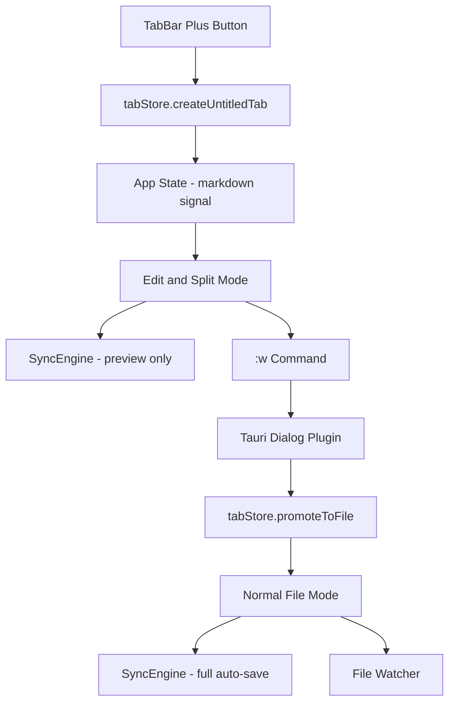
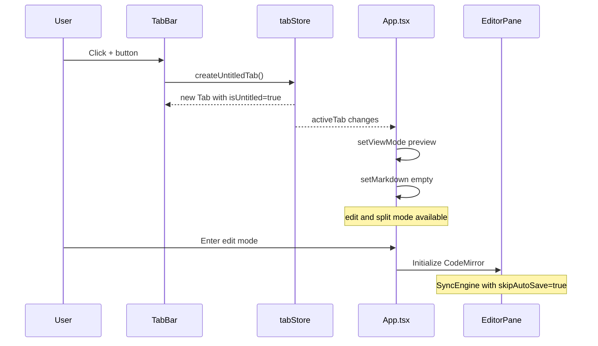
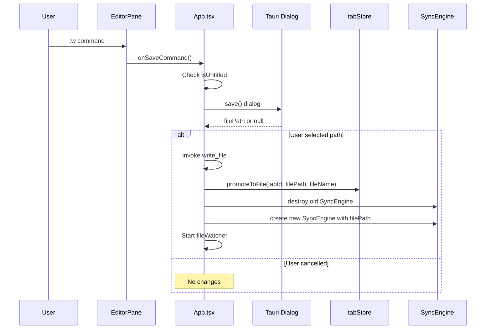
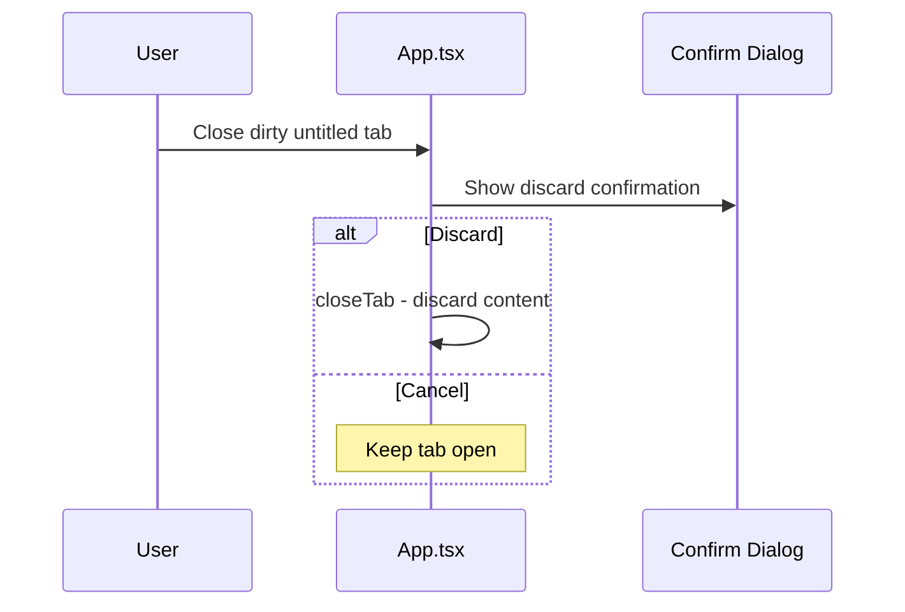

# Design Document: untitled-buffer

## Overview

**Purpose**: TabBar 上の「+」ボタンから新規 untitled バッファを作成し、ファイルがなくても Markdown の編集・プレビューを可能にする。Save As で任意パスに保存し、通常の file モードに昇格する。

**Users**: ターミナルAI開発者が GitHub からのコピペや一時的な Markdown 作成を kusa 上で行う。

**Impact**: 既存の tabStore、SyncEngine、TabBar、App.tsx を拡張。buffer.ts は変更なし。

### Goals
- untitled バッファの作成・編集・プレビューを既存ファイルと同等に実現
- Save As によるローカル保存と file モードへの昇格
- 既存機能への影響を最小限に抑える

### Non-Goals
- テンプレートからの新規作成（将来対応）
- 複数ファイルの一括作成
- untitled バッファの永続化（アプリ再起動で消失）

## Architecture

### Architecture Pattern & Boundary Map



**Architecture Integration**:
- Selected pattern: 既存 tabStore の拡張 + App.tsx の Save As フロー追加
- Frontend/Backend 境界: Save As ダイアログは Tauri plugin-dialog 経由、ファイル書き込みは既存 `write_file` コマンド
- IPC contract: 新規 IPC コマンドなし（既存 `write_file` + Tauri dialog plugin を使用）
- Existing patterns preserved: Tab 管理、SyncEngine、EditMode 切替フロー

### Technology Stack

| Layer | Choice / Version | Role in Feature | Notes |
|-------|------------------|-----------------|-------|
| Frontend | SolidJS + TypeScript | TabStore 拡張、UI、Save As フロー | |
| Backend | Rust (Tauri v2) | ファイル書き込み | 既存コマンド使用 |
| Dialog | tauri-plugin-dialog 2.x | OS ネイティブ Save As ダイアログ | 新規依存 |
| Styling | Tailwind CSS | +ボタンのスタイリング | |

## System Flows

### Untitled バッファ作成フロー



### Save As フロー



### Dirty タブ閉じるフロー



## Requirements Traceability

| Requirement | Summary | Components | Interfaces | Flows |
|-------------|---------|------------|------------|-------|
| 1.1 | +ボタンで untitled タブ作成 | TabBar, tabStore | createUntitledTab() | 作成フロー |
| 1.2 | 連番名 Untitled-N | tabStore | createUntitledTab() | 作成フロー |
| 1.3 | 重複しない連番 | tabStore | untitledCounter | 作成フロー |
| 1.4 | 最大タブ数制限 | tabStore | MAX_TABS check | 作成フロー |
| 2.1 | 全モード切替許可 | App.tsx | enterEditMode guard 変更 | - |
| 2.2 | CodeMirror vim mode | EditorPane | 既存（変更なし） | - |
| 2.3 | リアルタイムプレビュー | SyncEngine | skipAutoSave option | - |
| 2.4 | isDirty インジケーター | tabStore, TabBar | 既存（変更なし） | - |
| 3.1 | :w で Save As ダイアログ | App.tsx | handleSave 分岐 | Save As フロー |
| 3.2 | ファイル書き込み | App.tsx | invoke write_file | Save As フロー |
| 3.3 | file モード昇格 | tabStore | promoteToFile() | Save As フロー |
| 3.4 | 昇格後 auto-save 有効 | SyncEngine | 再生成 | Save As フロー |
| 3.5 | キャンセル時維持 | App.tsx | dialog null check | Save As フロー |
| 4.1 | 未変更タブ即座に閉じる | App.tsx | handleTabClose | 閉じるフロー |
| 4.2 | 変更済み確認ダイアログ | App.tsx | confirm dialog | 閉じるフロー |
| 4.3 | 破棄選択で閉じる | App.tsx | handleTabClose | 閉じるフロー |
| 4.4 | キャンセルで維持 | App.tsx | handleTabClose | 閉じるフロー |
| 5.1 | +ボタン常時表示 | TabBar | onNewTab prop | - |
| 5.2 | ダークテーマ対応 | TabBar | Tailwind classes | - |
| 5.3 | タブ0個で表示 | TabBar | Show条件変更 | - |
| 5.4 | 最大時無効化 | TabBar | disabled prop | - |
| 6.1 | auto-save 無効 | SyncEngine | skipAutoSave | - |
| 6.2 | file watcher 無効 | App.tsx | isUntitled check | - |
| 6.3 | 昇格後 auto-save 有効 | SyncEngine | 再生成 | Save As フロー |

## Components and Interfaces

| Component | Domain/Layer | Intent | Req Coverage | Key Dependencies | Contracts |
|-----------|--------------|--------|--------------|------------------|-----------|
| tabStore | State | untitled タブの作成・昇格 | 1.1-1.4, 3.3 | なし | State |
| TabBar | UI | +ボタン表示 | 5.1-5.4 | tabStore | Event |
| App.tsx | Orchestration | Save As フロー、モードガード | 2.1, 3.1-3.5, 4.1-4.4, 6.1-6.3 | tabStore, SyncEngine, Dialog | Service |
| SyncEngine | Service | preview-only モード | 2.3, 6.1 | markdown processor | State |

### State Layer

#### tabStore (拡張)

| Field | Detail |
|-------|--------|
| Intent | untitled タブの作成・管理・file モード昇格 |
| Requirements | 1.1, 1.2, 1.3, 1.4, 3.3 |

**Responsibilities & Constraints**
- untitled タブの一意 ID 生成と連番名管理
- file モードへの昇格（filePath 設定、名前更新、フラグ切替）
- 既存タブ操作（close, switch, etc.）との互換性維持

**Dependencies**
- Inbound: App.tsx — タブ操作 (Critical)
- Inbound: TabBar — タブ表示 (Critical)

**Contracts**: State

##### State Management

**Tab interface 拡張**:
```typescript
export interface Tab {
  id: string;
  filePath: string;
  fileName: string;
  content: string;
  isDirty: boolean;
  scrollPosition: number;
  isUntitled: boolean;  // NEW
}
```

**新規メソッド**:
```typescript
/** Create a new untitled tab with empty content */
createUntitledTab(): string;  // returns tab id

/** Promote untitled tab to file tab */
promoteToFile(id: string, filePath: string, fileName: string): void;
```

**連番管理**:
- モジュールレベルの counter（`let untitledCounter = 0`）
- `createUntitledTab` 呼び出しごとにインクリメント
- タブを閉じても番号は再利用しない

### UI Layer

#### TabBar (拡張)

| Field | Detail |
|-------|--------|
| Intent | +ボタンの表示、untitled タブ表示名対応 |
| Requirements | 5.1, 5.2, 5.3, 5.4 |

**Responsibilities & Constraints**
- +ボタンの表示（TabBar 右端、常時表示）
- タブ0個でも TabBar を表示（+ボタンのため）
- 最大タブ数到達時の+ボタン無効化

**Dependencies**
- Inbound: App.tsx — props (Critical)
- Outbound: tabStore — 状態参照 (Critical)

**Contracts**: Event

**Props 拡張**:
```typescript
interface TabBarProps {
  tabs: Accessor<Tab[]>;
  activeTabId: Accessor<string | null>;
  onTabClick: (id: string) => void;
  onTabClose: (id: string) => void;
  onNewTab: () => void;       // NEW
  isMaxTabs: boolean;          // NEW
}
```

**Show 条件変更**: `tabs().length > 0` → 常時表示（+ボタンが常にアクセス可能）

### Service Layer

#### SyncEngine (拡張)

| Field | Detail |
|-------|--------|
| Intent | untitled バッファでの preview-only 動作 |
| Requirements | 2.3, 6.1 |

**Responsibilities & Constraints**
- `skipAutoSave: true` 時はファイル書き込みをスキップ
- preview 更新は通常通り動作
- dirty 状態管理は通常通り動作

**Contracts**: State

**Config 拡張**:
```typescript
export interface SyncEngineConfig {
  previewDebounceMs: number;
  autoSaveDebounceMs: number;
  filePath: string;
  initialContent?: string;
  skipAutoSave?: boolean;  // NEW - untitled バッファ用
  onPreviewUpdate: (html: string) => void;
  onSaveComplete: () => void;
  onSaveError: (error: string) => void;
  onDirtyChange: (isDirty: boolean) => void;
}
```

**動作変更**: `handleContentChange` 内で `skipAutoSave` が true の場合、`saveDebounce.call()` をスキップ

### Orchestration Layer

#### App.tsx (拡張)

| Field | Detail |
|-------|--------|
| Intent | Save As フロー、edit mode ガード変更、untitled タブ閉じる |
| Requirements | 2.1, 3.1-3.5, 4.1-4.4, 6.2, 6.3 |

**主要変更点**:

1. **`enterEditMode` ガード変更**: `isBufferMode()` チェックは維持、untitled タブは file 扱いで通過

2. **`handleSave` 分岐**: untitled タブの場合 Save As ダイアログを表示
```typescript
async function handleSave() {
  const tab = tabStore.activeTab();
  if (tab?.isUntitled) {
    await handleSaveAs(tab);
    return;
  }
  syncEngineRef?.forceSave();
}
```

3. **`handleSaveAs` 新規関数**:
```typescript
async function handleSaveAs(tab: Tab) {
  const filePath = await save({
    filters: [{ name: "Markdown", extensions: ["md"] }],
  });
  if (!filePath) return;  // cancelled

  await invoke("write_file", { path: filePath, content: editorRef?.getContent() ?? tab.content });

  const fileName = filePath.split(/[\\/]/).pop() || filePath;
  tabStore.promoteToFile(tab.id, filePath, fileName);

  // Recreate SyncEngine with full auto-save
  syncEngineRef?.destroy();
  syncEngineRef = createSyncEngineForFile(filePath, tab.content);

  // Start file watcher
  await fileWatcher.watch(filePath);

  updateWindowTitle({ source: "file", content: tab.content, title: fileName, filePath });
}
```

4. **`handleTabClose` 拡張**: untitled + isDirty の場合、確認ダイアログ
```typescript
// In handleTabClose, before closing:
if (tab.isUntitled && tab.isDirty) {
  const confirmed = await confirm("Discard unsaved changes?");
  if (!confirmed) return;
}
```

5. **`createSyncEngineForFile` / untitled 分岐**: untitled タブでは `skipAutoSave: true`

6. **Tab active effect での fileWatcher**: untitled タブでは `fileWatcher.watch()` をスキップ

### Dependencies (新規)

#### tauri-plugin-dialog

**Rust (Cargo.toml)**:
```toml
tauri-plugin-dialog = "2"
```

**JS (package.json)**:
```json
"@tauri-apps/plugin-dialog": "^2"
```

**Rust plugin 登録** (`lib.rs`):
```rust
.plugin(tauri_plugin_dialog::init())
```

**Capabilities** (`src-tauri/capabilities/default.json`):
```json
"dialog:default"
```

## Error Handling

### Error Strategy
既存パターンに従い、ユーザーへのフィードバックは StatusBar の notification 経由。

### Error Categories
- **Save As ファイル書き込み失敗**: StatusBar に "Save failed: {error}" 表示、untitled 状態を維持
- **Dialog キャンセル**: エラーではない、何もしない
- **Tab 上限到達**: +ボタン無効化で事前防止

## Testing Strategy

### Unit Tests
- `tabStore.createUntitledTab()`: 連番生成、MAX_TABS 制限
- `tabStore.promoteToFile()`: filePath 更新、isUntitled フラグクリア
- SyncEngine `skipAutoSave` 動作確認

### Integration Tests
- +ボタン → untitled タブ作成 → edit モード → 内容入力 → :w → Save As フロー
- dirty untitled タブの閉じる確認ダイアログ

### E2E Tests
- 新規 untitled → 編集 → Save As → file モード昇格 → auto-save 動作
